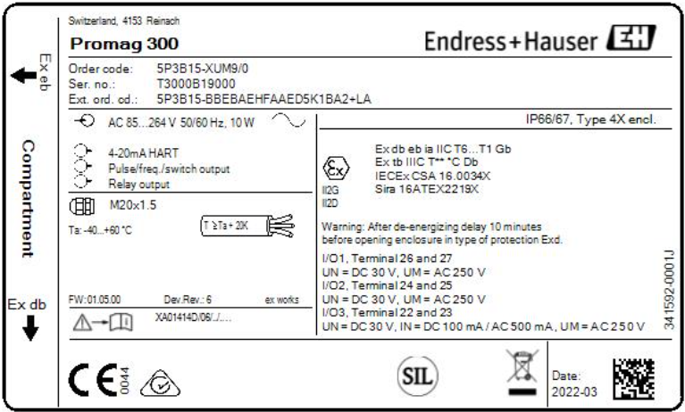

[width="100%", cols="1,1", frame=none, grid=none]
|===

|{set:cellbgcolor:#0029cc} 
|

2+|
2+|
2+|
2+|
2+|
2+|
2+|
2+|
2+|
2+|
2+|
2+|
2+|
2+|
2+|
2+|
2+|
2+|
2+|
2+|
2+|

2+|[.huge.white]*IDTA 02006-2-0 +
Digital Nameplate for Industrial Equipment*

2+|[.normal.white]#Date: 20. October 2022#

2+|
2+|
2+|
2+|
2+|
|image:idta-spec-badge.png[width="80%"]
|
2+|
2+|
2+|
2+|
2+|

|[.normal.white]#{nbsp}# +
[.large.white]#Submodel Template specification for the Asset Administration Shell#
|image:idta-smt-badge.png[]

|{set:cellbgcolor:#ffffff}
|

|===

<<<

== Imprint 

Publisher
[verse]
____
Industrial Digital Twin Association
Lyoner Strasse 18
60528 Frankfurt am Main
Germany
https://www.industrialdigitaltwin.org/
____

== Version history

[cols="1,1,4"]
|===

|Date
|Version
|Comment

|2020-11-24
|1.0
|This version is the first version officially published by ZVEI and Plattform Industrie 4.0.

|2022-10-20
|2.0
|Release of the official Submodel template published by IDTA. This version is based on V1.0.

|===

:sectnums:

== General

=== About this document
This document is a part of a specification series. Each part specifies the contents of a 
Submodel template for the Asset Administration Shell (AAS). The AAS is described 
in [1], [2], [3] and [6]. First exemplary Submodel contents were described in [4], 
while the actual format of this document was derived by the 
"Administration Shell in Practice" [5]. The format aims to be very concise, 
giving only minimal necessary information for applying a Submodel template, 
while leaving deeper descriptions and specification of concepts, structures and 
mapping to the respective documents [1] to [6].

=== Scope of the Submodel
This Submodel template aims to provide asset nameplate information to the respective Asset Administration Shells in an interoperable manner. Central element is the provision of properties [7], ideally interoperable by the means of dictionaries such as ECLASS and IEC CDD (Common Data Dictionary). While in the current version an IRI is provided for a small quantity of the specified properties as their semantic identifier, a complete harmonization of all properties is planned for the subsequent version 2.1. The purpose of this document is to make selected specifications of Submodels in such manner that information about assets and their nameplate can be exchanged in a meaningful way between partners in a value creation network. It targets equipment for process industry and factory automation by defining standardized meta data. 

The intended use case is the provision of a standardized property structure within a digital nameplate, which enables the interoperability of digital nameplates from different manufacturers.

This concept can serve as a basis for standardizing the respective Submodel. The conception is based on existing norms, directives and standards so that a far-reaching acceptance can be achieved. 

Beside standardized Submodel this template also introduces standardized SubmodelElementCollections (SMC) in order to improve the interoperability while modelling partial aspects within Submodels. The standardized SMCs include address and asset product marking.

=== Relevant standards for the Submodel template
The current version of the Submodel template is considered to meet the minimum requirement for nameplate information, hence it concentrates on the requirements specified by EU directives according to the Blue Guide published in the Official Journal of the EU-Commission. Furthermore, the current version provides a concept for modelling nameplate information required in the field of explosion protection according to the Directive 2014/34/EU. 

The EU directive 2006/42/EC aims to standardize the market entry requirements for machines in the European economic area and further related countries. In regard to nameplate the EU directive establishes the minimum requirements on information a nameplate should provide which state as follows:

•	the business name and full address of the manufacturer and, where applicable, his authorised representative,
•	designation of the machinery,
•	the CE Marking,
•	designation of series or type,
•	serial number, if any,
•	the year of construction, that is the year in which the manufacturing process is completed.

With regard to explosion-protected equipment, various additional information is required for the respective device to be contained in the nameplate [8]. The additional information set also strongly depends on the country, e.g.

•	Directive 2014/34/EU: specific mark of explosion protection, Equipment Group, Category, Gas or Dust areas etc.
•	IEC Ex: Type of Protection, Equipment Protection Level, certificate number, etc.
•	North America: Class, Division, Groups, Type of Protection, etc.
According to [3], interoperable properties might be defined by standards, consortium specifcations or manufacturer specifications. Useful standards providing sources of concepts are:
Table 1 List of examplary standards defining interoperable properties

[cols="1,1"]
|===
|IEC 62890:2020-07 — Industrial-process measurement, control and automation - Life-cycle-management for systems and components
|Describes basic concepts of product types and instances and the concepts of a life-cycle mode

|VDMA 24903 — Obsolescence management – Exchange of information regarding change and discontinuance of products and items	
|Describes important event in the life-cycle of a product type and identifies important information elements to be conveyed
|===

So called property dictionaries are used identify information elements (see Terms and Definitions of [6]). Such property dictionaries include:

•	ECLASS, see: https://www.eclasscontent.com/
•	IEC CDD, see: https://cdd.iec.ch/cdd/iec61987/iec61987.nsf and https://cdd.iec.ch/cdd/iec62683/cdddev.nsf

In this document, properties are aimed to be described by ECLASS.
Further relevant basic requirements for nameplates are described in [8] and [9].
Requirements specified by further regulations and directives will be taken into account in subsequent versions.

== Information set for Submodel “Nameplate”

=== Approach
The Submodel template was motivated by the prior ZVEI project “Digital Nameplate”. While defining Submodels the following three aspects must be considered as suggested in [5]:

*Use and economic relevance*

A nameplate contains identifying, descriptive and indicating information about an asset. Given the variety of requirements from national and global institutions, conventional nameplate have reached their limits of presenting mandatory content. Especially for industrial equipment in explosion hazardous areas the amount of information required on the markings has increased even more. The Submodel “Nameplate” helps to standardize the information structure for modelling a nameplate in compliance with EU Machine Directive 2006/42/EC. As a result, a breakthrough of restrictions due to limited labeling field can be achieved. At the same time the availability of asset information is widened from local to global level enabling further partners along the value chain to have access to nameplate information. The machine readability can be realized without ambiguity with the help of semantic information.

*Possible functions and interactions*

The Submodel “Nameplate” provides information from a nameplate. Customers or potential customers can use this Submodel to acquire identifying, classifying information about an asset, such as the manufacturer name, model type or serial number and the provided product markings. Customers can also use this Submodel to verify the asset with their order. Beside the customers public authorities and inter-trade organizations may also share interest in this Submodel in order to examine the information integrity stipulated for a nameplate. Manufacturers use this Submodel to fulfill the legal commitment on the one hand, on the other hand this Submodel helps them to identify the right asset in case maintenance services or spare parts are needed.

By using the SMC “Marking” and its child element SMC “ExplosionSafety” mandatory nameplate content related to explosion protection can be modelled sufficiently. The modelling method was concepted in such manner that a wide range of national and international regulations and standards regarding explosion protection were taken into account.

In order to take regulations for nameplate from further standards or directives into account additional properties can be modelled with SMC “AssetSpecificProperties” and its child element SMC “GuidelineSpecificProperties” while reference to the additional standard document should be stored in the property “GuidelineForConformityDeclaration”. A separate SMC “GuidelineSpecificProperties” needs to be created for each additional standard and all SMC “GuidelineSpecificProperties” should be placed under the parent node “AssetSpecificProperties”.

*Property specification*

See clause 3 “Submodel and collections“.

=== Overview UML model
The following figure gives an overview on the different elements of the Submodel.

[plantuml, UML_overview, svg]
----
include::UML_overview.puml[]
----

== Submodel and collections

=== Properties of the Submodel “Nameplate”
The following figure shows the UML-diagram for the respective element. 

[plantuml, UML_main, svg]
----
include::UML_main.puml[]
----

The following figure shows the table for the respectice element. 

// Table generated from [Submodel, www.example.com/ids/sm/2255_3110_7032_7261],[SubmodelElementCollection, 3_1_Submodel],[ReferenceElement, Tables_main]

[width="100%", cols="15%,55%,15%,15%"]
|===
s|{set:cellbgcolor:#0029cc} [white]#idShort:#
3+s|{set:cellbgcolor:#eeeeee}Nameplate 

s|{set:cellbgcolor:#0029cc} [white]#Class:#
3+s|{set:cellbgcolor:#eeeeee}Submodel 

s|{set:cellbgcolor:#0029cc} [white]#semanticId:#
3+s|{set:cellbgcolor:#eeeeee}https://admin-shell.io/zvei/nameplate/2/0/Nameplate 

s|{set:cellbgcolor:#0029cc} [white]#Parent:#
3+s|{set:cellbgcolor:#eeeeee}Nameplate 

s|{set:cellbgcolor:#0029cc} [white]#Explanation:#
3+s|{set:cellbgcolor:#eeeeee}Contains the nameplate information attached to the product@en 

s|{set:cellbgcolor:#0029cc} [white]#Element details:#
3+s|{set:cellbgcolor:#eeeeee}- 

s|{set:cellbgcolor:#0029cc} [white]#[SME type] +
 +
idShort#
s| [white]#semanticId +
 +
Description@en#
s| [white]#[valueType] +
 +
example#
s| [white]#card.#

|{set:cellbgcolor:#eeeeee}[Prop] +
 +
URIOfTheProduct
|0173-1#02-AAY811#001 +
 +
 unique global identification of the product using an universal resource identifier (URI) Note: see also [IRDI] 0112/2///61987#ABN590#001 URI of product instance 
|[String] +
 +
https://www.domain-abc.com/Model-Nr-1234/Serial-Nr-5678
|1

|[MLP] +
 +
ManufacturerName
|0173-1#02-AAO677#002 +
 +
 legally valid designation of the natural or judicial person which is directly responsible for the design, production, packaging and labeling of a product in respect to its being brought into circulation Note: see also [IRDI] 0112/2///61987#ABA565#007 manufacturer Note: mandatory property according to EU Machine Directive 2006/42/EC. 
|[-] +
 +
Muster AG@de
|1

|[MLP] +
 +
ManufacturerProductDesignation
|0173-1#02-AAW338#001 +
 +
 Short description of the product (short text)  Note: see also [IRDI] 0112/2///61987#ABA567#007 name of product Note: Short designation of the product is meant. Note: mandatory property according to EU Machine Directive 2006/42/EC. 
|[-] +
 +
ABC-123@en
|1

|[SMC] +
 +
ContactInformation
|https://admin-shell.io/zvei/nameplate/1/0/ContactInformations/ContactInformation +
 +
 The SMC “ContactInformation” contains information on how to contact the manufacturer or an authorised service provider, e.g. when a maintenance service is required The SMC “ContactInformation” contains information on how to contact the manufacturer or an authorised service provider, e.g. when a maintenance service is required. Note: physical address is a mandatory property according to EU Machine Directive 2006/42/EC
|[-] +
 +
23 elements
|1

|[MLP] +
 +
ManufacturerProductRoot
|0173-1#02-AAU732#001 +
 +
 Top level of a 3 level manufacturer specific product hierarchy -
|[-] +
 +
flow meter@en
|0..1

|[MLP] +
 +
ManufacturerProductFamily
|0173-1#02-AAU731#001 +
 +
 2nd level of a 3 level manufacturer specific product hierarchy Note: conditionally mandatory property according to EU Machine Directive 2006/42/EC. One of the two properties must be provided: ManufacturerProductFamily (0173-1#02-AAU731#001) or ManufacturerProductType (0173-1#02-AAO057#002). 
|[-] +
 +
Type ABC@en
|0..1

|[MLP] +
 +
ManufacturerProductType
|0173-1#02-AAO057#002 +
 +
 Characteristic to differentiate between different products of a product family or special variants Note: see also [IRDI] 0112/2///61987#ABA300#006 code of product Note: conditionally mandatory property according to EU Machine Directive 2006/42/EC. One of the two properties must be provided: ManufacturerProductFamily (0173-1#02-AAU731#001) or ManufacturerProductType (0173-1#02-AAO057#002). 
|[-] +
 +
FM-ABC-1234@en
|0..1

|[MLP] +
 +
OrderCodeOfManufacturer
|0173-1#02-AAO227#002 +
 +
 By manufactures issued unique combination of numbers and letters used to identify the device for ordering Note: see also [IRDI] 0112/2///61987#ABA950#006 order code of product Note: Recommendation: property declaration as MLP is required by its semantic definition. As the property value is language independent, users are recommended to provide maximal 1 string in any language of the user’s choice.
|[-] +
 +
FMABC1234@en
|0..1

|[MLP] +
 +
ProductArticleNumberOfManufacturer
|0173-1#02-AAO676#003 +
 +
 unique product identifier of the manufacturer Note: see also [IRDI] 0112/2///61987#ABA581#006 article number Note: Recommendation: property declaration as MLP is required by its semantic definition. As the property value is language independent, users are recommended to provide maximal 1 string in any language of the user’s choice.
|[-] +
 +
FM11-ABC22-123456@en
|0..1

|[Prop] +
 +
SerialNumber
|0173-1#02-AAM556#002 +
 +
 unique combination of numbers and letters used to identify the device once it has been manufactured Note: see also [IRDI] 0112/2///61987#ABA951#007 serial number 
|[String] +
 +
12345678
|0..1

|[Prop] +
 +
YearOfConstruction
|0173-1#02-AAP906#001 +
 +
 Year as completion date of object Note: mandatory property according to EU Machine Directive 2006/42/EC. 
|[String] +
 +
2022
|1

|[Prop] +
 +
DateOfManufacture
|0173-1#02-AAR972#002 +
 +
 Date from which the production and / or development process is completed or from which a service is provided completely Note: see also [IRDI] 0112/2///61987#ABB757#007 date of manufacture Note: format by lexical representation: CCYY-MM-DD 
|[Date] +
 +
2022-01-01
|0..1

|[MLP] +
 +
HardwareVersion
|0173-1#02-AAN270#002 +
 +
 Version of the hardware supplied with the device Note: see also [IRDI] 0112/2///61987#ABA926#006 hardware version Note: Recommendation: property declaration as MLP is required by its semantic definition. As the property value is language independent, users are recommended to provide maximal 1 string in any language of the user’s choice.
|[-] +
 +
1.0.0@en
|0..1

|[MLP] +
 +
FirmwareVersion
|0173-1#02-AAM985#002 +
 +
 Version of the firmware supplied with the device Note: see also [IRDI] 0112/2///61987#ABA302#004 firmware version Note: Recommendation: property declaration as MLP is required by its semantic definition. As the property value is language independent, users are recommended to provide maximal 1 string in any language of the user’s choice.
|[-] +
 +
1.0@en
|0..1

|[MLP] +
 +
SoftwareVersion
|0173-1#02-AAM737#002 +
 +
 Version of the software used by the device Note: see also [IRDI] 0112/2///61987#ABA601#006 software version Note: Recommendation: property declaration as MLP is required by its semantic definition. As the property value is language independent, users are recommended to provide maximal 1 string in any language of the user’s choice.
|[-] +
 +
1.0.0@en
|0..1

|[Prop] +
 +
CountryOfOrigin
|0173-1#02-AAO259#004 +
 +
 Country where the product was manufactured Note: see also [IRDI] 0112/2///61360_4#ADA034#001 country of origin Note: Country codes defined accord. to DIN EN ISO 3166-1 alpha-2 codes 
|[String] +
 +
DE
|0..1

|[File] +
 +
CompanyLogo
|https://admin-shell.io/zvei/nameplate/2/0/Nameplate/CompanyLogo  +
 +
 A graphic mark used to represent a company, an organisation or a product -
|[-] +
 +

|0..1

|[SML] +
 +
Markings
|0173-1#01-AGZ673#001 +
 +
 Collection of product markings Note: CE marking is declared as mandatory according to EU Machine Directive 2006/42/EC.
|[-] +
 +
1 elements
|0..*

|[SMC] +
 +
AssetSpecificProperties
|0173-1#01-AGZ672#001 +
 +
 Group of properties that are listed on the asset's nameplate and are grouped based on guidelines Note: defined as “Asset specific nameplate information” per ECLASS 
|[-] +
 +
2 elements
|0..1

|===

=== 3.3 Properties of the SMC “Markings”
The following figure shows the UML-diagram for the respective element. 

[plantuml, UML_markings, svg]
----
include::UML_markings.puml[]
----

The following figure shows the table for the respectice element. 

// Table generated from [Submodel, www.example.com/ids/sm/2255_3110_7032_7261],[SubmodelElementCollection, 3_2_Markings],[ReferenceElement, Tables_markings]

[width="100%", cols="15%,55%,15%,15%"]
|===
s|{set:cellbgcolor:#0029cc} [white]#idShort:#
3+s|{set:cellbgcolor:#eeeeee}Markings 

s|{set:cellbgcolor:#0029cc} [white]#Class:#
3+s|{set:cellbgcolor:#eeeeee}SubmodelElementList 

s|{set:cellbgcolor:#0029cc} [white]#semanticId:#
3+s|{set:cellbgcolor:#eeeeee}0173-1#01-AGZ673#001 

s|{set:cellbgcolor:#0029cc} [white]#Parent:#
3+s|{set:cellbgcolor:#eeeeee}Markings 

s|{set:cellbgcolor:#0029cc} [white]#Explanation:#
3+s|{set:cellbgcolor:#eeeeee}Note: CE marking is declared as mandatory according to EU Machine Directive 2006/42/EC.@en 

s|{set:cellbgcolor:#0029cc} [white]#Element details:#
3+s|{set:cellbgcolor:#eeeeee}orderRelevant=No, typeValueListElement=SubmodelElement 

s|{set:cellbgcolor:#0029cc} [white]#[SME type] +
 +
idShort#
s| [white]#semanticId +
 +
Description@en#
s| [white]#[valueType] +
 +
example#
s| [white]#card.#

|{set:cellbgcolor:#eeeeee}[SMC] +
 +
Marking
|0173-1#01-AHD206#001 +
 +
- - Note: see also [IRDI] 0112/2///61987#ABH515#003 Certificate or approval Note: CE marking is declared as mandatory according to the Blue Guide of the EU-Commission 
|[-] +
 +
7 elements
|-

|===

Regarding the property “MarkingName” the preferable solution is to provide a valueId in IRDI originating from ECLASS enumeration value list, e.g. "CE” (IRDI: 0173-1#07-DAA603#004). In case none of the existing ECLASS enumeration values matches, filling plain string text into the “value” field of the property “MarkingName” can be accepted alternatively. It needs to be pointed out that ECLASS also provides marking definitions in terms of boolean property, e.g. “CE- qualification present” (IRDI: 0173-1#02-BAF053#008). In this case users should instead use a matching ECLASS enumeration value or, if not provided as enumeration, fill in plain string text.

The following example illustrates how to model product marking in an AAS. The following figures gives a sample nameplate which contains two markings to be modelled: the CE marking and the WEEE marking with a crossed-out wheeled bin. 

image::image11.png[width="40.5%"]

The following figture lists all properties and their attributes. 

== Examples for using SMC “ExplosionSafety”
Due to the complexity of SMC “ExplosionSafety” examples are offered in this section to show best practices based on real nameplates. 

=== 4.1 Remote I/O Module 9468 (AI/AO, 8 channels)
The following figure shows the nameplate of a Remote I/O module.

The following table describes the details of the SMC structure.

[width="100%",cols="19%,13%,16%,4%,12%,12%,12%,12%",options="header",]
|===
|Parent element |semanticId |Element |Unit |SMC 01 |SMC 02 |SMC 03 |SMC
04
|Marking |https://admin-shell.io/zvei/ +
nameplate/2/0/ +
Nameplate/ +
Markings/Marking/ +
ExplosionSafeties |SMC “ExplosionSafeties” | | | | |

|SMC “ExplosionSafeties” |https://admin-shell.io/zvei/ +
nameplate/2/0/ +
Nameplate/ +
Markings/Marking/ ExplosionSafeties/ +
ExplosionSafety |SMC “ExplosionSafety” | |DEKRA12ATEX0173X_01
|DEKRA12ATEX0173X_02 |FM17US0332X_01 |FM17US0332X_02

|SMC “ExplosionSafety” |0112/2///61987#ABH783#001
|DesignationOfCertificateOrApproval | |DEKRA12ATEX0173X
|DEKRA12ATEX0173X |FM17US0332X |FM17US0332X

|SMC “ExplosionSafety” |0173-1#02-AAM812#003 |TypeOfApproval | |IECEX@EN
|IECEX@EN |IECEX@EN |IECEX@EN

|SMC “ExplosionSafety” |0173-1#02-AAM632#001
|ApprovalAgencyTestingAgency | |CSA@EN |CSA@EN |CSA@EN |CSA@EN

|SMC “ExplosionSafety” |0173-1#02-AAQ325#003 |TypeOfProtection | |Ex ia
[ia Ga] |[Ex ia Da] |IS; AIS |AEx ia [ia]

|SMC “ExplosionSafety” |0112/2///61987#ABO102#001
|InstructionsControlDrawing | |https://xxx.pdf |https://xxx.pdf
|https://xxx.pdf |https://xxx.pdf

|SMC “ExplosionSafety” |https://admin-shell.io/ +
zvei/nameplate/2/0/ +
Nameplate/ +
Markings/Marking/ +
ExplosionSafeties/ +
ExplosionSafety/ +
SpecificConditionsForUse |SpecificConditionsForUse | |X |X |X |X

|SMC “ExplosionSafety” |https://admin-shell.io/zvei/ +
nameplate/2/0/ +
Nameplate/ +
Markings/Marking/ +
ExplosionSafeties/ +
ExplosionSafety/ +
AmbientConditions |SMC “AmbientConditions” | |*existing* |*existing*
|*existing* |*existing*

|SMC “AmbientConditions” |0173-1#02-AAK297#004 |DeviceCategory | |2(1)G
|(1)D | |

|SMC “AmbientConditions” |0173-1#02-AAM668#001 |EquipmentProtectionLevel
| |Gb | | |

|SMC “AmbientConditions” |https://admin-shell.io/ +
zvei/nameplate/2/0/ +
Nameplate/ +
Markings/Marking/ +
ExplosionSafeties/ +
ExplosionSafety/ +
RegionalSpecificMarking |RegionalSpecificMarking | | | |Class I,
Division 1 |Class I, Zone 1

|SMC “AmbientConditions” |0173-1#02-AAQ325#003 |TypeOfProtection | |ia |
|IS |ia

|SMC “AmbientConditions” |0173-1#02-AAT372#001 |ExplosionGroup | |IIC
|IIIC |A,B,C,D |IIC

|SMC “AmbientConditions” |0173-1#02-AAZ952#001
|MinimumAmbientTemperature |ºC |-40 |-40 |-40 |-40

|SMC “AmbientConditions” |0173-1#02-BAA039#010 |MaxAmbientTemperature
|ºC |75 |75 |75 |75

|SMC “AmbientConditions” |0173-1#02-AAO371#004 |TemperatureClass | |T4 |
|T4 |T4

|SMC “ExplosionSafety” |https://admin-shell.io/zvei +
/nameplate/2/0/ +
Nameplate/ +
Markings/Marking/ +
ExplosionSafeties/ +
ExplosionSafety/ +
ExternalElectricalCircuit |SMC “ExternalElectricalCircuit” |
|ExternalElectricalCircuit_01 |ExternalElectricalCircuit_01
|ExternalElectricalCircuit_01 |ExternalElectricalCircuit_01

|SMC “ExternalElectricalCircuit_01” |0112/2///61987#ABB147#004
|DesignationOfElectricalTerminal | |1+ / 2- |1+ / 2- |1+ / 2- |1+ / 2-

|SMC “ExternalElectricalCircuit_01” |0173-1#02-AAQ325#003
|TypeOfProtection | |ia |ia |IS |ia

|SMC “ExternalElectricalCircuit_01” |0173-1#02-AAM668#001
|EquipmentProtectionLevel | |Ga |Da |Class I, Division 1 |Class I, Zone
1

|SMC “ExternalElectricalCircuit_01” |0173-1#02-AAT372#001
|ExplosionGroup | |IIC |IIIC |A,B |IIC

|SMC “ExternalElectricalCircuit_01” |https://admin-shell.io/zvei/ +
nameplate/2/0/Nameplate/ +
Markings/Marking/ +
ExplosionSafeties/ +
ExplosionSafety/ +
ExternalElectricalCircuit/ +
Characteristics |Characteristics | |linear |linear |linear |linear

|SMC “ExternalElectricalCircuit_01” |0173-1#02-AAQ380#006 |SMC
“SafetyRelated +
PropertiesFor +
PassiveBehaviour” | |*existing* |*existing* |*non-existing*
|*non-existing*

|SMC “SafetyRelated +
PropertiesFor +
PassiveBehaviour” |0173-1#02-AAM640#004 |MaxInternalCapacitance |µF |0
|0 | |

|SMC “SafetyRelated +
PropertiesFor +
PassiveBehaviour” |0173-1#02-AAM639#003 |MaxInternalInductance |mH |0 |0
| |

|SMC “ExternalElectricalCircuit_01” |0173-1#02-AAQ381#006 |SMC
“SafetyRelated +
PropertiesFor +
ActiveBehaviour” | |*existing* |*existing* |*existing* |*existing*

a|
SMC “SafetyRelated

PropertiesFor

ActiveBehaviour”

|0173-1#02-AAQ371#003 |MaxOutputPower |mW |488 |488 |488 |488

a|
SMC “SafetyRelated

PropertiesFor

ActiveBehaviour”

|0173-1#02-AAM635#003 |MaxOutputVoltage |V |24.4 |24.4 |24.4 |24.4

a|
SMC “SafetyRelated

PropertiesFor

ActiveBehaviour”

|0173-1#02-AAM641#004 |MaxOutputCurrent |mA |80 |80 |80 |80

a|
SMC “SafetyRelated

PropertiesFor

ActiveBehaviour”

|0173-1#02-AAM637#004 |MaxExternalCapacitance |µF |0.053 |0.053 |0.053
|0.053

a|
SMC “SafetyRelated

PropertiesFor

ActiveBehaviour”

|0173-1#02-AAM636#003 |MaxExternalInductance |mH |3.8 |3.8 |3.8 |3.8

|SMC “ExplosionSafety” |https://admin-shell.io/zvei +
/nameplate/2/0/ +
Nameplate/ +
Markings/Marking/ +
ExplosionSafeties/ +
ExplosionSafety/ +
ExternalElectricalCircuit |SMC “ExternalElectricalCircuit” |
|ExternalElectricalCircuit_02 |ExternalElectricalCircuit_02
|ExternalElectricalCircuit_02 |ExternalElectricalCircuit_02

|SMC “ExternalElectricalCircuit_02” |0112/2///61987#ABB147#004
|DesignationOfElectricalTerminal | |1+ / 2+ / 4- |1+ / 2+ / 4- |1+ / 2+
/ 4- |1+ / 2+ / 4-

|SMC “ExternalElectricalCircuit_02” |0173-1#02-AAQ325#003
|TypeOfProtection | |ia |ia |IS |ia

|SMC “ExternalElectricalCircuit_02” |0173-1#02-AAM668#001
|EquipmentProtectionLevel | |Ga |Da |Class I, Division 1 |Class I, Zone
1

|SMC “ExternalElectricalCircuit_02” |0173-1#02-AAT372#001
|ExplosionGroup | |IIC |IIIC |A,B |IIC

|SMC “ExternalElectricalCircuit_02” |https://admin-shell.io/zvei/ +
nameplate/2/0/Nameplate/ +
Markings/Marking/ +
ExplosionSafeties/ +
ExplosionSafety/ +
ExternalElectricalCircuit/ +
Characteristics |Characteristics | |linear |linear |linear |linear

|SMC “ExternalElectricalCircuit_02” |0173-1#02-AAQ380#006 |SMC
“SafetyRelated +
PropertiesFor +
PassiveBehaviour” | |*existing* |*existing* |*existing* |*existing*

|SMC “SafetyRelated +
PropertiesFor +
PassiveBehaviour” |0173-1#02-AAM640#004 |MaxInternalCapacitance |µF |0
|0 |0 |0

|SMC “SafetyRelated +
PropertiesFor +
PassiveBehaviour” |0173-1#02-AAM639#003 |MaxInternalInductance |mH |0 |0
|0 |0

|SMC “ExternalElectricalCircuit_02” |0173-1#02-AAQ381#006 |SMC
“SafetyRelated +
PropertiesFor +
ActiveBehaviour” | |*existing* |*existing* |*existing* |*existing*

a|
SMC “SafetyRelated

PropertiesFor

ActiveBehaviour”

|0173-1#02-AAQ371#003 |MaxOutputPower |mW |499 |499 |499 |499

a|
SMC “SafetyRelated

PropertiesFor

ActiveBehaviour”

|0173-1#02-AAM635#003 |MaxOutputVoltage |V |24.4 |24.4 |24.4 |24.4

a|
SMC “SafetyRelated

PropertiesFor

ActiveBehaviour”

|0173-1#02-AAM641#004 |MaxOutputCurrent |mA |81.8 |81.8 |81.8 |81.8

a|
SMC “SafetyRelated

PropertiesFor

ActiveBehaviour”

|0173-1#02-AAM637#004 |MaxExternalCapacitance |µF |0.053 |0.053 |0.053
|0.053

a|
SMC “SafetyRelated

PropertiesFor

ActiveBehaviour”

|0173-1#02-AAM636#003 |MaxExternalInductance |mH |3.6 |3.6 |3.6 |3.6

|SMC “ExplosionSafety” |https://admin-shell.io/zvei +
/nameplate/2/0/ +
Nameplate/ +
Markings/Marking/ +
ExplosionSafeties/ +
ExplosionSafety/ +
ExternalElectricalCircuit |SMC “ExternalElectricalCircuit” |
|ExternalElectricalCircuit_03 |ExternalElectricalCircuit_03
|ExternalElectricalCircuit_03 |ExternalElectricalCircuit_03

|SMC “ExternalElectricalCircuit_03” |0112/2///61987#ABB147#004
|DesignationOfElectricalTerminal | |2+ / 4- |2+ / 4- |2+ / 4- |2+ / 4-

|SMC “ExternalElectricalCircuit_03” |0173-1#02-AAQ325#003
|TypeOfProtection | |ia |ia |IS |ia

|SMC “ExternalElectricalCircuit_03” |0173-1#02-AAM668#001
|EquipmentProtectionLevel | |Ga |Da |Class I, Division 1 |Class I, Zone
1

|SMC “ExternalElectricalCircuit_03” |0173-1#02-AAT372#001
|ExplosionGroup | |IIC |IIIC |A,B |IIC

|SMC “ExternalElectricalCircuit_03” |https://admin-shell.io/zvei/ +
nameplate/2/0/Nameplate/ +
Markings/Marking/ +
ExplosionSafeties/ +
ExplosionSafety/ +
ExternalElectricalCircuit/ +
Characteristics |Characteristics | |linear |linear |linear |linear

|SMC “ExternalElectricalCircuit_03” |0173-1#02-AAQ380#006 |SMC
“SafetyRelated +
PropertiesFor +
PassiveBehaviour” | |*existing* |*existing* |*existing* |*existing*

|SMC “SafetyRelated +
PropertiesFor +
PassiveBehaviour” |0173-1#02-AAM638#003 |MaxInputVoltage |V |28 |28 |28
|28

|SMC “SafetyRelated +
PropertiesFor +
PassiveBehaviour” |0173-1#02-AAM642#004 |MaxInputCurrent |mA |105 |105
|105 |105

|SMC “SafetyRelated +
PropertiesFor +
PassiveBehaviour” |0173-1#02-AAM640#004 |MaxInternalCapacitance |µF |0
|0 |0 |0

|SMC “SafetyRelated +
PropertiesFor +
PassiveBehaviour” |0173-1#02-AAM639#003 |MaxInternalInductance |mH |0 |0
|0 |0

|SMC “ExternalElectricalCircuit_03” |0173-1#02-AAQ381#006 |SMC
“SafetyRelated +
PropertiesFor +
ActiveBehaviour” | |*existing* |*existing* |*existing* |*existing*

a|
SMC “SafetyRelated

PropertiesFor

ActiveBehaviour”

|0173-1#02-AAQ371#003 |MaxOutputPower |mW |0 |0 |0 |0

a|
SMC “SafetyRelated

PropertiesFor

ActiveBehaviour”

|0173-1#02-AAM635#003 |MaxOutputVoltage |V |0 |0 |0 |0

a|
SMC “SafetyRelated

PropertiesFor

ActiveBehaviour”

|0173-1#02-AAM641#004 |MaxOutputCurrent |mA |0 |0 |0 |0
|===

:sectnums!:

== Annex A.	Explanations on used table formats

=== 1. General

The used tables in this document try to outline information as concise as possible. They do not convey all information on Submodels and SubmodelElements. For this purpose, the definitive definitions are given by a separate file in form of an AASX file of the Submodel template and its elements.

=== 2. Tables on Submodels and SubmodelElements

For clarity and brevity, a set of rules is used for the tables for describing Submodels and SubmodelElements.

* The tables follow in principle the same conventions as in [5].
* The table heads abbreviate 'cardinality' with 'card'.
* The tables often place two informations in different rows of the same table cell. In this case, the first information is marked out by sharp brackets [] form the second information. A special case are the semanticIds, which are marked out by the format: (type)(local)[idType]value.
* The types of SubmodelElements are abbreviated:

[width="100%",cols="40%,60%",options="header"]
|===
|SME type |SubmodelElement type
|Property |Property
|MLP |MultiLanguageProperty
|Range |Range
|File |File
|Blob |Blob
|Ref |ReferenceElement
|Rel |RelationshipElement
|SMC |SubmodelElementCollection
|===

* If an idShort ends with '{00}', this indicates a suffix of the respective length (here: 2) of decimal digits, in order to make the idShort unique. A different idShort might be choosen, as long as it is unique in the parent’s context.
* The Keys of semanticId in the main section feature only idType and value, such as: https://admin-shell.io/vdi/2770/1/0/DocumentId/Id. The attribute "type" (typically "ConceptDescription" and "(local)" or "GlobalReference") need to be set accordingly; see [6].
* If a table does not contain a column with "parent" heading, all represented attributes share the same parent. This parent is denoted in the head of the table.
* Multi-language strings are represented by the text value, followed by '@'-character and the ISO 639 language code: example@EN.
* The [valueType] is only given for Properties.

:sectnums!:

== Annex B.	Sample ECLASS definitions for product marking

The following table provides sample ECLASS definitions for modelling product marking in SMC “Marking”. Further values will be provided by ECLASS or other repositories.

[width="100%",cols="10%,40%,50%",options="header"]
|===
|Item |IRDI |preferredName@en
|1 |0173-1#07-AAB047#003 |CCC
|2 |0173-1#07-DAA603#004 |CE
|3 |0173-1#07-AAA555#001 |CECC mark of conformity
|4 |0173-1#07-AAU119#001 |DGRL
|5 |0173-1#07-ABC243#001 |EAC
|6 |0173-1#07-WAA099#003 |EEx ia
|7 |0173-1#07-WAA102#003 |EExedIIC
|8 |0173-1#07-WAA101#003 |EExmII
|9 |0173-1#07-WAA094#003 |Explosion-proof
|10 |0173-1#07-AAA374#003 |GS mark of conformity
|11 |0173-1#07-AAA375#001 |TÜV sign
|12 |0173-1#07-AAA554#001 |VDE mark of conformity
|===
:sectnums!:

== Bibliography

[width="100%",cols="10%,90%", frame=none, grid=none]
|===

|[1] |“Recommendations for implementing the strategic initiative
INDUSTRIE 4.0”, acatech, April 2013. [Online]. Available
https://www.acatech.de/Publikation/recommendations-for-implementing-the-strategic-initiative-industrie-4-0-final-report-of-the-industrie-4-0-working-group/

|[2] |“Implementation Strategy Industrie 4.0: Report on the results of
the Industrie 4.0 Platform”; BITKOM e.V. / VDMA e.V., /ZVEI e.V., April
2015. [Online]. Available:
https://www.bitkom.org/noindex/Publikationen/2016/Sonstiges/Implementation-Strategy-Industrie-40/2016-01-Implementation-Strategy-Industrie40.pdf

|[3] |“The Structure of the Administration Shell: TRILATERAL
PERSPECTIVES from France, Italy and Germany”, March 2018, [Online].
Available:
https://www.plattform-i40.de/I40/Redaktion/EN/Downloads/Publikation/hm-2018-trilaterale-coop.html

|[4] |“Beispiele zur Verwaltungsschale der Industrie 4.0-Komponente –
Basisteil (German)”; ZVEI e.V., Whitepaper, November 2016. [Online].
Available:
https://www.zvei.org/presse-medien/publikationen/beispiele-zur-verwaltungsschale-der-industrie-40-komponente-basisteil/

|[5] |“Verwaltungsschale in der Praxis. Wie definiere ich Teilmodelle,
beispielhafte Teilmodelle und Interaktion zwischen Verwaltungsschalen
(in German)”, Version 1.0, April 2019, Plattform Industrie 4.0 in
Kooperation mit VDE GMA Fachausschuss 7.20, Federal Ministry for
Economic Affairs and Energy (BMWi), Available:
https://www.plattform-i40.de/PI40/Redaktion/DE/Downloads/Publikation/2019-verwaltungsschale-in-der-praxis.html

|[6] |“Details of the Asset Administration Shell; Part 1 - The exchange
of information between partners in the value chain of Industrie 4.0
(Version 3.0RC01)”, November 2020, [Online]. Available:
https://www.plattform-i40.de/PI40/Redaktion/EN/Downloads/Publikation/Details-of-the-Asset-Administration-Shell-Part1.html

|[7] |“Semantic interoperability: challenges in the digital
transformation age”; IEC, International Electronical Commission; 2019.
[Online]. Available:
https://basecamp.iec.ch/download/iec-white-paper-semantic-interoperability-challenges-in-the-digital-transformation-age-en/

|[8] |“E DIN VDE V 0170-100 VDE V 0170-100:2019-10 Digitales Typenschild
- Teil 100: Digitale Produktkennzeichnung”, October 2019, VDE VERLAG.

|[9] |“DIN SPEC 91406:2019-12 Automatic identification of physical
objects and information on physical objects in IT systems, particularly
IoT systems; Text in German and English”, December 2019.

|[10] |“OMG Unified Modeling Language (OMG UML)”, Formal/2017-12-05,
Version 2.5.1. December 2018. [Online] Available:
https/www.omg.org/spec/UML/

|[11] |“IDTA 2002-1-0 Submodel for Contact Information”, 24 May 2022,
Industrial Digital Twin Association, [Online]. Available:
https://github.com/admin-shell-io/Submodel-templates/blob/main/published/Contact%20Information/1/IDTA%202002-1-0_Submodel_ContactInformation.pdf

|===

[%always]
<<<

[width="100%", cols="1,1", frame=none, grid=none]
|===

|{set:cellbgcolor:#0029cc} 
|

2+|
2+|
2+|
2+|
2+|
2+|
2+|
2+|
2+|
2+|
2+|
2+|
2+|
2+|
2+|
2+|
2+|[.large.white]#www.industrialdigitaltwin.org#
2+|
2+|
2+|
2+|
2+|
2+|
2+|
2+|
2+|
2+|
2+|

|===

