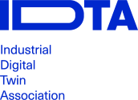

:toc: left
:toc-title: Digital Nameplate for Industrial Equipment
:stylesheet: ../../style.css
:favicon: ../../favicon.png
:nofooter:

= Submodel Template of the Asset Administration Shell
:author: IDTA
:version-label: Number
:revnumber: 4711-1-0
:revdate: Month YEAR
:revremark: Submodel Template of the Asset Administration Shell

== General

=== About this document

This document is a part of a specification series. Each part specifies the contents of a Submodel template for the Asset Administration Shell (AAS). The AAS is described in link:#bib1[[1\]], link:#bib2[[2\]], link:#bib3[[3\]] and link:#bib6[[6\]]. First exemplary Submodel contents were described in link:#bib4[[4\]], while the actual format of this document was derived by the "Administration Shell in Practice" link:#bib5[[5\]]. The format aims to be very concise, giving only minimal necessary information for applying a Submodel template, while leaving deeper descriptions and specification of concepts, structures and mapping to the respective documents link:#bib1[[1\]] to link:#bib6[[6\]].

The target group of the specification are developers and editors of technical documentation and manufacturer information, which are describing assets in smart manufacturing by means of the Asset Administration Shell (AAS) and therefore need to create a Submodel instance with a hierarchy of SubmodelElements. This document especially details on the question, which SubmodelElements with which semantic identification shall be used for this purpose.

=== Scope of the Submodel

Description of the Scope

=== Relevant standards for the Submodel template

List of relevant standards with titel

=== Use cases, requirements and design decisions

List of relevant use cases.

== Submodel TITLE

=== Approach

Please describe the approach

=== Title

If you need to use figures, pleas use the figure desciptions

.Example of a figure

=== Title

If you need to use general tables, pleasd use the table descriptions.

Example of a table description

[width="100%",cols="14%,34%,52%",options="header",]
|===
|Tabel ID |ClassID |Description
|01-01 |Identification |
|02-01 |Technical specifiction |
|===

=== Attributes

Table for attributes look like this. Please remember to use the table descriptions.

[.table-with-appendix-table]
[cols="16%h,84%",]
|===
|*idShort:* a|
ManufacturerDocumentation\{00}

====
Note: a different idShort might be used, as long as it is unqiue in the Submodel.
====

|*Class:* |Submodel (SM)
|*semanticId:* |[IRI] https://admin-shell.io/vdi/2770/1/1/Documentation
|*Parent:* |Asset Administration Shell, to which the documents shall be associated to
|*Explanation:* |The Submodel defines a set of manufacturer documentation to bring about information from manufacturer to operator of industrial equipment.
|===
[width="100%",cols="16%h,50%,25%,9%"]
|===
h|*[SME type]* h|*semanticId = [idType]value* h|*[valueType]* h|*card.*
h|*idShort* h|*Description@en* h|*example* h|
a|
[SMC]

Document\{00}

a|
[IRI] http://admin-shell.io/vdi/2770/1/0/Document

Each SMC describes a Document (see IEC 82045-1 and IEC 8245-2), which is asscoated to the particular Asset Administration Shell.

|n/a |0..*
a|
[Entity]

Entity\{00}

a|
[IRI] http://admin-shell.io/vdi/2770/1/0/EntityForDocumentation

States, that the described Entity is an important entity for documentation of the superordinate Asset of the Asset Administration Shell.

====
Note: typically, such Entities are well-identified sub-parts of the Asset, such as supplier parts delivered to the manufacturer of the Asset.
====

====
Note: these Entities are the target of the “DocumentedEntity"-ReferenceElements of the particular Documents contained in this Submodel. This mechanism substitutes the ObjectId-provision of VDI 2770 (see section 2.2).
====

====
Note: If the described Entity has an own Asset Administration Shell, the SelfManaged-flag and AssetId-reference of the Entity shall be set accordingly.
====

|Entity for an important sealing or bearing of the quipment. |0..*
|===

== Explanations on used table formats

=== General

The used tables in this document try to outline information as concise as possible. They do not convey all information on Submodels and SubmodelElements. For this purpose, the definitive definitions are given by a separate file in form of an AASX file of the Submodel template and its elements.

=== Tables on Submodels and SubmodelElements

For clarity and brevity, a set of rules is used for the tables for describing Submodels and SubmodelElements.

* The tables follow in principle the same conventions as in link:#bib5[[5\]].
* The table heads abbreviate 'cardinality' with 'card'.
* The tables often place two informations in different rows of the same table cell. In this case, the first information is marked out by sharp brackets [] form the second information. A special case are the semanticIds, which are marked out by the format: (type)(local)[idType]value.
* The types of SubmodelElements are abbreviated:

[width="100%",cols="41%,59%",options="header",]
|===
|SME type |SubmodelElement type
|Property |Property
|MLP |MultiLanguageProperty
|Range |Range
|File |File
|Blob |Blob
|Ref |ReferenceElement
|Rel |RelationshipElement
|SMC |SubmodelElementCollection
|===

* If an idShort ends with '\{00}', this indicates a suffix of the respective length (here: 2) of decimal digits, in order to make the idShort unique. A different idShort might be choosen, as long as it is unique in the parent’s context.
* The Keys of semanticId in the main section feature only idType and value, such as: [IRI]https://admin-shell.io/vdi/2770/1/0/DocumentId/Id. The attributes `type` and "local" (typically `ConceptDescription` and "(local)" or `GlobalReference` and (no-local)") need to be set accordingly; see link:#bib6[[6\]].
* If a table does not contain a column with `parent` heading, all represented attributes share the same parent. This parent is denoted in the head of the table.
* Multi-language strings are represented by the text value, followed by '@'-character and the ISO 639 language code: example@EN.
* The [valueType] is only given for Properties.

== Bibliography

[#bib1]
[1] “Recommendations for implementing the strategic initiative INDUSTRIE 4.0”, acatech, April 2013. [Online]. Available https://www.acatech.de/Publikation/recommendations-for-implementing-the-strategic-initiative-industrie-4-0-final-report-of-the-industrie-4-0-working-group/

[#bib2]
[2] “Implementation Strategy Industrie 4.0: Report on the results of the Industrie 4.0 Platform”; BITKOM e.V. / VDMA e.V., /ZVEI e.V., April 2015. [Online]. Available: https://www.bitkom.org/noindex/Publikationen/2016/Sonstiges/Implementation-Strategy-Industrie-40/2016-01-Implementation-Strategy-Industrie40.pdf

[#bib3]
[3] “The Structure of the Administration Shell: TRILATERAL PERSPECTIVES from France, Italy and Germany”, March 2018, [Online]. Available: https://www.plattform-i40.de/I40/Redaktion/EN/Downloads/Publikation/hm-2018-trilaterale-coop.html

[#bib4]
[4] “Beispiele zur Verwaltungsschale der Industrie 4.0-Komponente – Basisteil (German)”; ZVEI e.V., Whitepaper, November 2016. [Online]. Available: https://www.zvei.org/presse-medien/publikationen/beispiele-zur-verwaltungsschale-der-industrie-40-komponente-basisteil/

[#bib5]
[5] “Verwaltungsschale in der Praxis. Wie definiere ich Teilmodelle, beispielhafte Teilmodelle und Interaktion zwischen Verwaltungsschalen (in German)”, Version 1.0, April 2019, Plattform Industrie 4.0 in Kooperation mit VDE GMA Fachausschuss 7.20, Federal Ministry for Economic Affairs and Energy (BMWi), Available: https://www.plattform-i40.de/PI40/Redaktion/DE/Downloads/Publikation/2019-verwaltungsschale-in-der-praxis.html

[#bib6]
[6] “Details of the Asset Administration Shell; Part 1 - The exchange of information between partners in the value chain of Industrie 4.0 (Version 3.0RC01)”, November 2020, [Online]. Available: https://www.plattform-i40.de/PI40/Redaktion/EN/Downloads/Publikation/Details-of-the-Asset-Administration-Shell-Part1.html

www.industrialdigitaltwin.org
