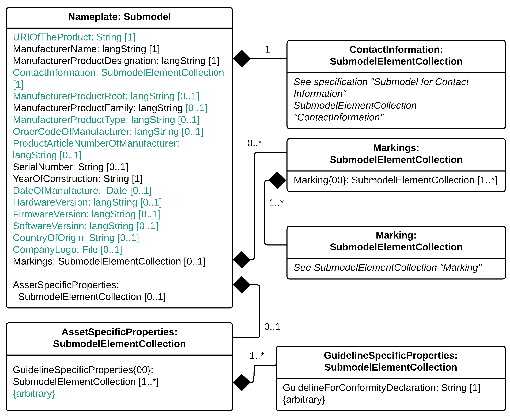
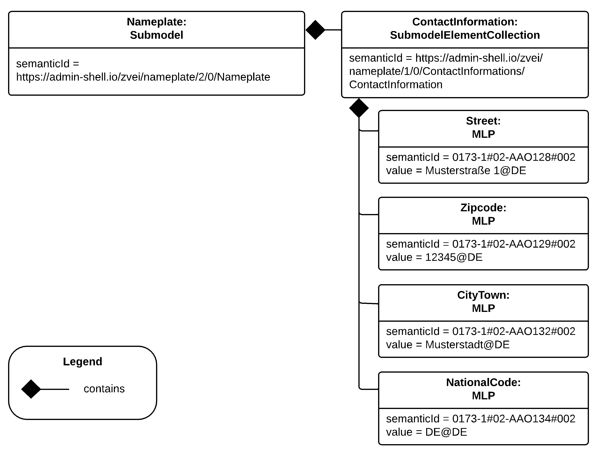

:toc: left
:toc-title: Digital Nameplate for Industrial Equipment
:stylesheet: ../style.css
:nofooter:

= Digital Nameplate for Industrial Equipment
:author: IDTA
:version-label: Number
:revnumber: 02006-2-0
:revdate: October 2022
:revremark: Submodel Template of the Asset Administration Shell

== General

=== About this document

This document is a part of a specification series. Each part specifies the contents of a Submodel template for the Asset Administration Shell (AAS). The AAS is described in link:#bib1[[1\]], link:#bib2[[2\]], link:#bib3[[3\]] and link:#bib6[[6\]]. First exemplary Submodel contents were described in link:#bib4[[4\]], while the actual format of this document was derived by the "Administration Shell in Practice" link:#bib5[[5\]]. The format aims to be very concise, giving only minimal necessary information for applying a Submodel template, while leaving deeper descriptions and specification of concepts, structures and mapping to the respective documents link:#bib1[[1\]] to link:#bib6[[6\]].

The target group of the specification are developers and editors of technical documentation and manufacturer information, which are describing assets in smart manufacturing by means of the Asset Administration Shell (AAS) and therefore need to create a Submodel instance with a hierarchy of SubmodelElements. This document especially details on the question, which SubmodelElements with which semantic identification shall be used for this purpose.

=== Scope of the Submodel

This Submodel template aims to provide asset nameplate information to the respective Asset Administration Shells in an interoperable manner. Central element is the provision of properties link:#bib7[[7\]], ideally interoperable by the means of dictionaries such as ECLASS and IEC CDD (Common Data Dictionary). While in the current version an IRI is provided for a small quantity of the specified properties as their semantic identifier, a complete harmonization of all properties is planned for the subsequent version 2.1. The purpose of this document is to make selected specifications of Submodels in such manner that information about assets and their nameplate can be exchanged in a meaningful way between partners in a value creation network. It targets equipment for process industry and factory automation by defining standardized meta data.

The intended use case is the provision of a standardized property structure within a digital nameplate, which enables the interoperability of digital nameplates from different manufacturers.

This concept can serve as a basis for standardizing the respective Submodel. The conception is based on existing norms, directives and standards so that a far-reaching acceptance can be achieved.

Beside standardized Submodel this template also introduces standardized SubmodelElementCollections (SMC) in order to improve the interoperability while modelling partial aspects within Submodels. The standardized SMCs include address and asset product marking.

=== Relevant standards for the Submodel template

The current version of the Submodel template is considered to meet the minimum requirement for nameplate information, hence it concentrates on the requirements specified by EU directives according to the Blue Guide published in the Official Journal of the EU-Commission. Furthermore, the current version provides a concept for modelling nameplate information required in the field of explosion protection according to the Directive 2014/34/EU.

The EU directive 2006/42/EC aims to standardize the market entry requirements for machines in the European economic area and further related countries. In regard to nameplate the EU directive establishes the minimum requirements on information a nameplate should provide which state as follows:

* the business name and full address of the manufacturer and, where applicable, his authorised representative,
* designation of the machinery,
* the CE Marking,
* designation of series or type,
* serial number, if any,
* the year of construction, that is the year in which the manufacturing process is completed.

With regard to explosion-protected equipment, various additional information is required for the respective device to be contained in the nameplate link:#bib8[[8\]]. The additional information set also strongly depends on the country, e.g.

* Directive 2014/34/EU: specific mark of explosion protection, Equipment Group, Category, Gas or Dust areas etc.
* IEC Ex: Type of Protection, Equipment Protection Level, certificate number, etc.
* North America: Class, Division, Groups, Type of Protection, etc.

According to link:#bib3[[3\]], interoperable properties might be defined by standards, consortium specifcations or manufacturer specifications. Useful standards providing sources of concepts are:

.List of examplary standards defining interoperable properties
|===
|IEC 62890:2020-07 — Industrial-process measurement, control and automation - Life-cycle-management for systems and components |Describes basic concepts of product types and instances and the concepts of a life-cycle mode
|VDMA 24903 — Obsolescence management – Exchange of information regarding change and discontinuance of products and items |Describes important event in the life-cycle of a product type and identifies important information elements to be conveyed
|===

So called property dictionaries are used identify information elements (see Terms and Definitions of link:#bib6[[6\]]). Such property dictionaries include:

* ECLASS, see: https://www.eclasscontent.com/
* IEC CDD, see: https://cdd.iec.ch/cdd/iec61987/iec61987.nsf and https://cdd.iec.ch/cdd/iec62683/cdddev.nsf

In this document, properties are aimed to be described by ECLASS.

Further relevant basic requirements for nameplates are described in link:#bib8[[8\]] and link:#bib9[[9\]].

Requirements specified by further regulations and directives will be taken into account in subsequent versions.

=== Explanations on used UML diagrams

For clarity and an improved legibility readers suggested to go through this section at first before reading the following chapters.

.Figure 1: Reading aid and example: UML notation used in this document
image:media/media/image3.png[media/media/image3,width=468,height=201]

Further details about UML diagrams please refer to link:#bib6[[6\]] and link:#bib10[[10\]].

Further details about used table formats please refer to Annex A.

== Information set for Submodel “Nameplate”

The Submodel template was motivated by the prior ZVEI project “Digital Nameplate”. While defining Submodels the following three aspects must be considered as suggested in link:#bib5[[5\]]:

*Use and economic relevance*

A nameplate contains identifying, descriptive and indicating information about an asset. Given the variety of requirements from national and global institutions, conventional nameplate have reached their limits of presenting mandatory content. Especially for industrial equipment in explosion hazardous areas the amount of information required on the markings has increased even more. The Submodel “Nameplate” helps to standardize the information structure for modelling a nameplate in compliance with EU Machine Directive 2006/42/EC. As a result, a breakthrough of restrictions due to limited labeling field can be achieved. At the same time the availability of asset information is widened from local to global level enabling further partners along the value chain to have access to nameplate information. The machine readability can be realized without ambiguity with the help of semantic information.

*Possible functions and interactions*

The Submodel “Nameplate” provides information from a nameplate. Customers or potential customers can use this Submodel to acquire identifying, classifying information about an asset, such as the manufacturer name, model type or serial number and the provided product markings. Customers can also use this Submodel to verify the asset with their order. Beside the customers public authorities and inter-trade organizations may also share interest in this Submodel in order to examine the information integrity stipulated for a nameplate. Manufacturers use this Submodel to fulfill the legal commitment on the one hand, on the other hand this Submodel helps them to identify the right asset in case maintenance services or spare parts are needed.

By using the SMC “Marking” and its child element SMC “ExplosionSafety” mandatory nameplate content related to explosion protection can be modelled sufficiently. The modelling method was concepted in such manner that a wide range of national and international regulations and standards regarding explosion protection were taken into account.

In order to take regulations for nameplate from further standards or directives into account additional properties can be modelled with SMC “AssetSpecificProperties” and its child element SMC “GuidelineSpecificProperties” while reference to the additional standard document should be stored in the property “GuidelineForConformityDeclaration”. A separate SMC “GuidelineSpecificProperties” needs to be created for each additional standard and all SMC “GuidelineSpecificProperties” should be placed under the parent node “AssetSpecificProperties”.

*Property specification*

See clause 3 “Submodel and collections“.

== Submodel and collections

=== Properties of the Submodel “Nameplate”

Figure 2 shows the UML-diagram defining the relevant properties which need to be set. Table 2 describes the details of the Submodel structure combined with examples.

.Figure 2: UML-Diagram for Submodel "Nameplate"

.Properties of Submodel "Nameplate"

[width=100%, cols="h,1", options="autowidth",]
|===
|idShort: a| Nameplate
====
Note: the above idShort shall always be as stated.
====
|Class: |Submodel
|semanticId: |[IRI] https://admin-shell.io/zvei/nameplate/2/0/Nameplate
|Explanation: |Contains the nameplate information attached to the product
|===
[%autowidth]
|===
h| [SME type] h| semanticId = [idType]value h| [valueType] h| card.
h| idShort h| Description@en* h| example h|
|[Property] +
URIOfTheProduct a|
[IRDI] 0173-1#02-AAY811#001

unique global identification of the product using an universal resource identifier (URI)

====
Note: see also [IRDI] 0112/2///61987#ABN590#001 URI of product instance
====

|[String]

https://www.domain-abc.com/Model-Nr-1234/Serial-Nr-5678

|1
|[MLP] +
ManufacturerName a|
[IRDI] 0173-1#02-AAO677#002

legally valid designation of the natural or judicial person which is directly responsible for the design, production, packaging and labeling of a product in respect to its being brought into circulation

====
Note: see also [IRDI] 0112/2///61987#ABA565#007 manufacturer
====

====
Note: mandatory property according to EU Machine Directive 2006/42/EC.
====

|[langString] +
Muster AG @DE |1
|[MLP] +
ManufacturerProductDesignation a|
[IRDI] 0173-1#02-AAW338#001

Short description of the product (short text)

====
Note: see also [IRDI] 0112/2///61987#ABA567#007 name of product
====

====
Note: Short designation of the product is meant.
====

====
Note: mandatory property according to EU Machine Directive 2006/42/EC.
====

|[langString]

ABC-123 @EN

Industrieroboter @DE

|1
|[SubmodelElementCollection] +
ContactInformation a|
[IRI] https://admin-shell.io/zvei/nameplate/1/0/ContactInformations/ContactInformation

The SMC “ContactInformation” contains information on how to contact the manufacturer or an authorised service provider, e.g. when a maintenance service is required

====
Note: physical address is a mandatory property according to EU Machine Directive 2006/42/EC.
====

See separate clause

|n/a |1
|[MLP] +
ManufacturerProductRoot a|
[IRDI] 0173-1#02-AAU732#001

Top level of a 3 level manufacturer specific product hierarchy

|[langString]

flow meter@EN

|0..1
|[MLP] +
ManufacturerProductFamily a|
[IRDI] 0173-1#02-AAU731#001

2nd level of a 3 level manufacturer specific product hierarchy

====
Note: conditionally mandatory property according to EU Machine Directive 2006/42/EC. One of the two properties must be provided: +
====

ManufacturerProductFamily (0173-1#02-AAU731#001) or +
ManufacturerProductType (0173-1#02-AAO057#002).

|[langString] +
Type ABC@EN |0..1
|[MLP] +
ManufacturerProductType a|
[IRDI] 0173-1#02-AAO057#002

Characteristic to differentiate between different products of a product family or special variants

====
Note: see also [IRDI] 0112/2///61987#ABA300#006 code of product
====

====
Note: conditionally mandatory property according to EU Machine Directive 2006/42/EC. One of the two properties must be provided: +
====

ManufacturerProductFamily (0173-1#02-AAU731#001) or +
ManufacturerProductType (0173-1#02-AAO057#002).

|[langString] +
FM-ABC-1234@EN |0..1
|[MLP]footnote:mlp[Recommendation: property declaration as MLP is required by its semantic definition. As the property value is language independent, users are recommended to provide maximal 1 string in any language of the user’s choice.] +
OrderCodeOfManufacturer a|
[IRDI] 0173-1#02-AAO227#002

By manufactures issued unique combination of numbers and letters used to identify the device for ordering

====
Note: see also [IRDI] 0112/2///61987#ABA950#006 order code of product
====

|[langString]footnote:mlp[] +
FMABC1234@EN |0..1
|[MLP]footnote:mlp[] +
ProductArticleNumberOfManufacturer a|
[IRDI] 0173-1#02-AAO676#003

unique product identifier of the manufacturer

====
Note: see also [IRDI] 0112/2///61987#ABA581#006 article number
====

|[langString]footnote:mlp[] +
FM11-ABC22-123456@EN |0..1
|[Property] +
SerialNumber a|
[IRDI] 0173-1#02-AAM556#002

unique combination of numbers and letters used to identify the device once it has been manufactured

====
Note: see also [IRDI] 0112/2///61987#ABA951#007 serial number
====

|[String] +
12345678 |0..1
|[Property] +
YearOfConstruction a|
[IRDI] 0173-1#02-AAP906#001

Year as completion date of object

====
Note: mandatory property according to EU Machine Directive 2006/42/EC.
====

|[String] +
2020 |1
|[Property] +
DateOfManufacture a|
[IRDI] 0173-1#02-AAR972#002

Date from which the production and / or development process is completed or from which a service is provided completely

====
Note: see also [IRDI] 0112/2///61987#ABB757#007 date of manufacture
====

====
Note: format by lexical representation: CCYY-MM-DD
====

|[Date] +
2021-01-01 |0..1
|[MLP]footnote:mlp[] +
HardwareVersion a|
[IRDI] 0173-1#02-AAN270#002

Version of the hardware supplied with the device

====
Note: see also [IRDI] 0112/2///61987#ABA926#006 hardware version
====

|[langString]footnote:mlp[] +
1.0.0@EN |0..1
|[MLP]footnote:mlp[] +
FirmwareVersion a|
[IRDI] 0173-1#02-AAM985#002

Version of the firmware supplied with the device

====
Note: see also [IRDI] 0112/2///61987#ABA302#004 firmware version
====

|[langString]footnote:mlp[] +
1.0@EN |0..1
|[MLP]footnote:mlp[] +
SoftwareVersion a|
[IRDI] 0173-1#02-AAM737#002

Version of the software used by the device

====
Note: see also [IRDI] 0112/2///61987#ABA601#006 software version
====

|[langString]footnote:mlp[] +
1.0.0@EN |0..1
|[Property] +
CountryOfOrigin a|
[IRDI] 0173-1#02-AAO259#004

Country where the product was manufactured

====
Note: see also [IRDI] 0112/2///61360_4#ADA034#001 country of origin
====

====
Note: Country codes defined accord. to DIN EN ISO 3166-1 alpha-2 codes
====

|[String] +
DE |0..1
|[File] +
CompanyLogo a|
[IRI] https://admin-shell.io/zvei/nameplate/2/0/Nameplate/CompanyLogo

A graphic mark used to represent a company, an organisation or a product

|[File] |0..1
|[SubmodelElementCollection] +
Markings a|
[IRDI] 0173-1#01-AGZ673#001

Collection of product markings

====
Note: CE marking is declared as mandatory according to EU Machine Directive 2006/42/EC.
====

See separate clause

|n/a |0..1
|[SubmodelElementCollection]

AssetSpecificProperties

a|
[IRDI] 0173-1#01-AGZ672#001

Group of properties that are listed on the asset's nameplate and are grouped based on guidelines

====
Note: defined as “Asset specific nameplate information” per ECLASS
====

See separate clause

|n/a |0..1
|===

=== Mandatory properties of the SMC “ContactInformation” for physical address

In order to provide information about a physical address, the SMC “ContactInformation” defined by link:#bib11[[11\]] is to be re-used in the context of digital nameplate.

Due to the fact that the SMC “ContactInformation” has been concepted to provide interoperable contact information thus all properties within the SMC “ContactInformation” are defined as optional, this chapter defines properties that are mandatorily required to ensure the provision of physical address.

Figure 3 shows the UML-diagram defining the relevant properties which need to be set mandatory.

Table 3 describes the details of the SMC structure combined with examples.

.Figure 3: UML-Diagram for SMC "ContactInformation" defined in Submodel “ContactInformations” by link:#bib11[[11\]]footnote:[As SMC “ContactInformation” is designed for re-usage in other submodels, the displayed cardinalities of properties in the UML diagramm differ from requirements for this submodel template.]

.Mandatory properties of SMC "ContactInformation"
[width=100%, cols="h,1", options="autowidth"]
|===
|idShort: a|
ContactInformation

====
Note: the above idShort shall always be as stated.
====

|Class: |SubmodelElementCollection
|semanticId: |[IRI] https://admin-shell.io/zvei/nameplate/1/0/ContactInformations/ContactInformation
|isCaseOf |[IRDI] 0173-1#02-AAQ837#005
|AllowDuplicates |True
|Parent: |Submodel “Nameplate”
|Explanation: |The SMC “ContactInformation” contains information on how to contact the manufacturer or an authorised service provider, e.g. when a maintenance service is required
|===
[%autowidth]
|===
h|[SME type] h|semanticId = [idType]value h|[valueType] h|card.
h|idShort h|Description@en h|example h|
|[MLP] +
Street a|
[IRDI] 0173-1#02-AAO128#002

street name and house number

====
Note: see also [IRDI] 0112/2///61987#ABA286#001 street
====

====
Note: mandatory property according to EU Machine Directive 2006/42/EC.
====

|[langString] +
Musterstraße 1@DE |1
|[MLP]footnote:mlp[] +
Zipcode a|
[IRDI] 0173-1#02-AAO129#002

ZIP code of address

====
Note: see also [IRDI] 0112/2///61987#ABA281#001 ZIP/Postal code
====

====
Note: mandatory property according to EU Machine Directive 2006/42/EC.
====

|[langString]footnote:mlp[]

12345@DE

|1
|[MLP] +
CityTown a|
[IRDI] 0173-1#02-AAO132#002

town or city

====
Note: see also [IRDI] 0112/2///61987#ABA129#001 city/town
====

====
Note: mandatory property according to EU Machine Directive 2006/42/EC.
====

|[langString]

Musterstadt@DE

|1
|[MLP]footnote:mlp[] +
NationalCode a|
[IRDI] 0173-1#02-AAO134#002

code of a country

====
Note: see also [IRDI] 0112/2///61360_4#ADA005#001 country code
====

====
Note: Country codes defined accord. to DIN EN ISO 3166-1 alpha-2 codes
====

====
Note: mandatory property according to EU Machine Directive 2006/42/EC.
====

|[langString]footnote:mlp[]

DE@DE

|1
|===

The following example in Figure 4 shows a possible modelling of SMC “Address” in Submodel “Nameplate”.

.Figure 4: Example modelling of SMC "ContactInformation"

=== Properties of the SMC “Markings”

Figure 2 shows the UML-diagram defining the relevant properties which need to be set. [.mark]####Table 4 describes the details of the SMC structure.

.Properties of SMC "Markings"
[width=100%, cols="h,1", options="autowidth"]
|===
|*idShort:* |Markings
|*Class:* |SubmodelElementCollection
|*semanticId:* |[IRDI] 0173-1#01-AGZ673#001
|*AllowDuplicates* |True
|*Parent:* |Submodel “Nameplate”
|*Explanation:* a|
Collection of product markings

====
Note: CE marking is declared as mandatory according to EU Machine Directive 2006/42/EC.
====

|===
[%autowidth]
|===
h|[SME type] h|semanticId = [idType]value h|[valueType] h|card.
h|idShort h|Description@en h|example h|
|[SubmodelElementCollection] +
Marking\{00} a|
[IRDI] 0173-1#01-AHD206#001

contains information about the marking labelled on the device

====
Note: see also [IRDI] 0112/2///61987#ABH515#003 Certificate or approval
====

====
Note: CE marking is declared as mandatory according to the Blue Guide of the EU-Commission
====

See separate clause.

|n/a |1..*
|===

=== Properties of the SMC “Marking” for product marking

Figure 5 shows the UML-diagram defining the relevant properties which need to be set. Table 5 describes the details of the SMC structure combined with examples.

.Figure 5: UML-Diagram for SMC "Marking"
image:media/media/image7.png[media/media/image7,width=564,height=247]

.Properties of SMC "Marking"
[width=100%, cols="h,1", options="autowidth"]
|===
|idShort: |Marking\{00}
|Class: |SubmodelElementCollection
|semanticId: |[IRDI] 0173-1#01-AHD206#001
|AllowDuplicates |True
|Parent: |SubmodelElementCollection “Markings”
|Explanation: a|
contains information about the marking labelled on the device

====
Note: see also [IRDI] 0112/2///61987#ABH515#003 Certificate or approval
====

|===
[%autowidth]
|===
h|[SME type] h|semanticId = [idType]value h|[valueType] h|card.
h|idShort h|Description@en h|example h|
|[Property] +
MarkingName a|
[IRI] https://admin-shell.io/zvei/nameplate/2/0/Nameplate/Markings/Marking/MarkingName

common name of the marking

====
Note: see also [IRDI] 0173-1#02-BAB392#015 certificate/approval
====

====
Note: CE marking is declared as mandatory according to Blue Guide of the EU-Commission
====

|[String] +
valueId with ECLASS enumeration IRDI is preferable, e.g. [IRDI] 0173-1#07-DAA603#004 for CE. If no IRDI available, string value can also be accepted.

Samples for valueId from ECLASS are listed in Annex B

|1
|[Property]

DesignationOfCertificateOrApproval

a|
[IRDI] 0112/2///61987#ABH783#001

alphanumeric character sequence identifying a certificate or approval

====
Note: Approval identifier, reference to the certificate number, to be entered without spaces
====

|[String]

KEMA99IECEX1105/128

|0..1
|[Property] +
IssueDate a|
[IRI] https://admin-shell.io/zvei/nameplate/2/0/Nameplate/Markings/Marking/IssueDate

Date, at which the specified certificate is issued

====
Note: format by lexical representation: CCYY-MM-DD
====

====
Note: to be specified to the day
====

|[Date]

2021-01-01

|0..1
|[Property] +
ExpiryDate a|
[IRI] https://admin-shell.io/zvei/nameplate/2/0/Nameplate/Markings/Marking/ExpiryDate

Date, at which the specified certificate expires

====
Note: see also [IRDI] 0173-1#02-AAO997#001 Validity date
====

====
Note: format by lexical representation: CCYY-MM-DD
====

====
Note: to be specified to the day
====

|[Date]

2021-01-01

|0..1
|[File] +
MarkingFile a|
[IRI] https://admin-shell.io/zvei/nameplate/2/0/Nameplate/Markings/Marking/MarkingFile

conformity symbol of the marking

|[File] +
/aasx/Nameplate/marking_ce.png |1
|[Property] +
MarkingAdditionalText\{00} a|
[IRI] https://admin-shell.io/zvei/nameplate/2/0/Nameplate/Markings/Marking/MarkingAdditionalText

where applicable, additional information on the marking in plain text, e.g. the ID-number of the notified body involved in the conformity process

====
Note: see also [IRDI] 0173-1#02-AAM954#002 details of other certificate
====

|[String] +
0044 |0..*
|[SubmodelElementCollection]

ExplosionSafeties

a|
[IRI] https://admin-shell.io/zvei/nameplate/2/0/Nameplate/Markings/Marking/ExplosionSafeties

Collection of explosion safefy specifications

See separate clause

|n/a |0..1
|===

Regarding the property “MarkingName” the preferable solution is to provide a valueId in IRDI originating from ECLASS enumeration value list, e.g. "CE” (IRDI: 0173-1#07-DAA603#004). In case none of the existing ECLASS enumeration values matches, filling plain string text into the “value” field of the property “MarkingName” can be accepted alternatively. It needs to be pointed out that ECLASS also provides marking definitions in terms of boolean property, e.g. “CE- qualification present” (IRDI: 0173-1#02-BAF053#008). In this case users should instead use a matching ECLASS enumeration value or, if not provided as enumeration, fill in plain string text.

The following example illustrates how to model product marking in an AAS. On the left side there is a sample nameplate which contains two markings to be modelled: the CE marking and the WEEE marking with a crossed-out wheeled bin. Next to the nameplate a table lists all properties and their attributes.

.Figure 6: Example modelling of SMC "Marking"
image:media/media/image8.png[media/media/image8,width=562,height=272]

=== Properties of the SMC “ExplosionSafeties”

Figure 5 shows the UML-diagram defining the relevant properties which need to be set. describes the details of the SMC structure

.Properties of SMC “ExplosionSafeties"
[width=100%, cols="h,1", options="autowidth"]
|===
|*idShort:* |ExplosionSafeties
|*Class:* |SubmodelElementCollection
|*semanticId:* |[IRI] https://admin-shell.io/zvei/nameplate/2/0/Nameplate/Markings/Marking/ExplosionSafeties
|*AllowDuplicates* |True
|*Parent:* |SubmodelElementCollection “Marking”
|===
[%autowidth]
|===
h|[SME type] h|semanticId = [idType]value h|[valueType] h|card.
h|idShort h|Description@en h|example h|
|[SubmodelElementCollection] +
ExplosionSafety\{00} a|
[IRI] https://admin-shell.io/zvei/nameplate/2/0/Nameplate/Markings/Marking/ExplosionSafeties/ExplosionSafety

contains information related to explosion safety according to device nameplate

See separate clause.

|n/a |1..*
|===

=== Properties of the SMC “ExplosionSafety”

Figure 7 shows the UML-diagram defining the relevant properties which need to be set.

Table 7 describes the details of the SMC structure.

.Figure 7: UML-Diagram of SMC "ExplosionSafety"
image:media/media/image9.png[media/media/image9,width=642,height=550]

.Properties of SMC “ExplosionSafety”
[width=100%, cols="h,1", options="autowidth"]
|===
|idShort: |ExplosionSafety
|Class: |SubmodelElementCollection
|semanticId: |[IRI] https://admin-shell.io/zvei/nameplate/2/0/Nameplate/Markings/Marking/ExplosionSafeties/ExplosionSafety
|AllowDuplicates |True
|Parent: |SubmodelElementCollection “ExplosionSafeties”
|Explanation: |contains information related to explosion safety according to device nameplate
|===
[%autowidth]
|===
h|[SME type] h|semanticId = [idType]value h|[valueType] h|card.
h|idShort h|Description@en h|example h|
|[Property]

DesignationOfCertificateOrApproval

a|
[IRDI] 0112/2///61987#ABH783#001

alphanumeric character sequence identifying a certificate or approval

====
Note: Approval identifier, reference to the certificate number, to be entered without spaces
====

|[String]

KEMA99IECEX1105/128

|0..1
|[MLP]footnote:mlp[]

TypeOfApproval

a|
[IRDI] 0173-1#02-AAM812#003 +
( [IRDI] 0112/2///61987#ABA231#008 type of hazardous area approval)

classification according to the standard or directive to which the approval applies

====
Note: name of the approval system, e.g. ATEX, IECEX, NEC, EAC, CCC, CEC
====

====
Note: only values from the enumeration should be used as stated. For additional systems further values can be used.
====

|[langString]footnote:mlp[]

ATEX@DE

|0..1
|[MLP]footnote:mlp[]

ApprovalAgencyTestingAgency

a|
[IRDI] 0173-1#02-AAM632#001 +
( [IRDI] 0112/2///61987#ABA634#004 approval agency/testing agency)

certificates and approvals pertaining to general usage and compliance with constructional standards and directives

====
Note: name of the agency, which has issued the certificate, e.g. PTB, KEMA, CSA, SIRA
====

====
Note: only values from the enumeration should be used as stated. For additional systems further values can be used.
====

|[langString]footnote:mlp[]

PTB@DE

|0..1
|[Property]

TypeOfProtection

a|
[IRDI] 0173-1#02-AAQ325#003 +
( [IRDI] 0112/2///61987#ABA589#002 type of protection (Ex))

classification of an explosion protection according to the specific measures applied to avoid ignition of a surrounding explosive atmosphere

====
Note: Type of protection for the device as listed in the certificate
====

====
Note: Symbol(s) for the Type of protection. Several types of protection are separated by a semicolon “;”
====

====
Note: If several TypeOfProtection are listed in the same certificate, for each TypeOfProtection a separate SMC “Explosion Safety” shall be provided
====

|[String]

db

NI; NIFW

Ex db eb ia

Ex db; Ex eb

|0..1
|[Property]

RatedInsulationVoltage

a|
[IRDI] 0173-1#02-AAN532#003

from the manufacturer for the capital assets limited isolation with given(indicated) operating conditions

====
Note: U~m~(eff)
====

====
Note: Insulation voltage, if specified in the certificate
====

|
[Decimal]

250

Unit: V

|0..1
|[ReferenceElement]

InstructionsControlDrawing

a|
[IRDI] 0112/2///61987#ABO102#001 file name of control/reference drawing

designation used to uniquely identify a control/reference drawing stored in a file system

====
Note: Reference to the instruction manual or control drawing
====

|[Reference] |0..1
|[Property]

SpecificConditionsForUse

a|
[IRI] https://admin-shell.io/zvei/nameplate/2/0/Nameplate/Markings/Marking/ExplosionSafeties/ExplosionSafety/SpecificConditionsForUse

====
Note: X if any, otherwise no entry
====

|[String]

X

|0..1
|[Property]

IncompleteDevice

a|
[IRI] https://admin-shell.io/zvei/nameplate/2/0/Nameplate/Markings/Marking/ExplosionSafeties/ExplosionSafety/IncompleteDevice

U if any, otherwise no entry

|[String]

U

|0..1
|[SubmodelElementCollection]

AmbientConditions

a|
[IRI] https://admin-shell.io/zvei/nameplate/2/0/Nameplate/Markings/Marking/ExplosionSafeties/ExplosionSafety/AmbientConditions

Contains properties which are related to the ambient conditions of the device.

====
Note: If the device is mounted in the process boundary, ambient and process conditions are provided separately.
====

See separate clause

|n/a |0..1
|[SubmodelElementCollection]

ProcessConditions

a|
[IRI] https://admin-shell.io/zvei/nameplate/2/0/Nameplate/Markings/Marking/ExplosionSafeties/ExplosionSafety/ProcessConditions

Contains properties which are related to the process conditions of the device.

====
Note: If the device is mounted in the process boundary, ambient and process conditions are provided separately.
====

See separate clause

|n/a |0..1
|[SubmodelElementCollection]

ExternalElectricalCircuit\{00}

a|
[IRI] https://admin-shell.io/zvei/nameplate/2/0/Nameplate/Markings/Marking/ExplosionSafeties/ExplosionSafety/ExternalElectricalCircuit

specifies the parameters of external electrical circuits.

====
Note: If several external circuits can be connected to the device, this block shall provide a cardinality with the number of circuits
====

====
Note: If for one external IS circuit several sets of safety parameters are provided (e.g. for several material groups), each set is specified in a separate block as a separate circuit.
====

See separate clause

|n/a |0..*
|===

=== Properties of the SMC “AmbientConditions”

Figure 7 shows the UML-diagram defining the relevant properties which need to be set. Table 8 describes the details of the SMC structure.

.Properties of SMC "AmbientConditions"
[width=100%, cols="h,1", options="autowidth"]
|===
|idShort: |AmbientConditions
|Class: |SubmodelElementCollection
|semanticId: |[IRI] https://admin-shell.io/zvei/nameplate/2/0/Nameplate/Markings/Marking/ExplosionSafeties/ExplosionSafety/AmbientConditions
|Parent: |SubmodelElementCollection “ExplosionSafety”
|Explanation: |Contains properties which are related to the ambient conditions of the device. If the device is mounted in the process boundary, ambient and process conditions are provided separately
|===
[%autowidth]
|===
h|[SME type] h|semanticId = [idType]value h|[valueType] h|card.
h|idShort h|Description@en h|example h|
|[Property]

DeviceCategory

a|
[IRDI] 0173-1#02-AAK297#004 +
( [IRDI] 0112/2///61987#ABA467#002 equipment/device category)

category of device in accordance with directive 94/9/EC

====
Note: editorial definiton: Category of device in accordance with directive 2014/34/EU
====

====
Note: Equipment category according to the ATEX system.
According to the current nameplate, also the combination “GD” is permitted
====

====
Note: The combination “GD” is no longer accepted and was changed in the standards. Currently the marking for “G” and “D” must be provided in a separate marking string. Older devices may still exist with the marking “GD”.
====

|[String]

2G

|0..1
|[MLP]footnote:mlp[]

EquipmentProtectionLevel

a|
[IRDI] 0173-1#02-AAM668#001 +
( [IRDI] 0112/2///61987#ABA464#005 equipment protection level)

part of a hazardous area classification system indicating the likelihood of the existence of a classified hazard

====
Note: editorial definition: Level of protection assigned to equipment based on its likelihood of becoming a source of ignition
====

====
Note: Equipment protection level according to the IEC standards. +
====

According to the current nameplate, also the combination “GD” is permitted

====
Note: The combination “GD” is no longer accepted and was changed in the standards. Currently the marking for “G” and “D” must be provided in a separate marking string. Older devices may still exist with the marking “GD”.
====

|[langString]footnote:mlp[]

Gb@DE

|0..1
|[Property]

RegionalSpecificMarking

a|
[IRI] https://admin-shell.io/zvei/nameplate/2/0/Nameplate/Markings/Marking/ExplosionSafeties/ExplosionSafety/RegionalSpecificMarking

Marking used only in specific regions, e.g. North America: class/divisions, EAC: “1” or NEC: “AIS”

|[String]

Class I, Division 2

|0..1
|[Property]

TypeOfProtection

a|
[IRDI] 0173-1#02-AAQ325#003 +
( [IRDI] 0112/2///61987#ABA589#002 type of protection (Ex))

classification of an explosion protection according to the specific measures applied to avoid ignition of a surrounding explosive atmosphere

====
Note: Symbol(s) for the Type of protection. Several types of protection are separated by a semicolon “;”
====

|[String]

db

NI; NIFW

Ex db eb ia

Ex db; Ex eb

|0..1
|[Property]

ExplosionGroup

a|
[IRDI] 0173-1#02-AAT372#001 +
( [IRDI] 0112/2///61987#ABA961#007 permitted gas group/explosion group)

classification of dangerous gaseous substances based on their ability to cause an explosion

====
Note: Equipment grouping according to IEC 60079-0 is meant by this property
====

====
Note: Symbol(s) for the gas group (IIA…IIC) or dust group (IIIA…IIIC)
====

|[String]

IIC

IIIB

A,B,C,D

|0..1
|[Property]

MinimumAmbientTemperature

a|
[IRDI] 0173-1#02-AAZ952#001 +
( [IRDI] 0112/2///61987#ABA621#007 minimum ambient temperature)

lower limit of the temperature range of the surrounding space in which the component, the pipework or the system can be operated

====
Note: editorial defnition: lower limit of the temperature range of the environment in which the component, the pipework or the system can be operated
====

====
Note: Rated minimum ambient temperature
====

|
[Decimal]

-40footnote:temp[Positive temperatures are listed without “+” sign. If several temperatures ranges are marked, only the most general range shall be indicated in the template, which is consistent with the specified temperature class or maximum surface temperature. Other temperature ranges and temperature classes/maximum surface temperatures may be listed in the instructions.]

Unit: ºC

|0..1
|[Property]

MaxAmbientTemperature

a|
[IRDI] 0173-1#02-BAA039#010 +
( [IRDI] 0112/2///61987#ABA623#007 maximum ambient temperature)

upper limit of the temperature range of the surrounding space in which the component, the pipework or the system can be operated

====
Note: editorial definition: upper limit of the temperature range of the environment in which the component, the pipework or the system can be operated
====

====
Note: Rated maximum ambient temperature
====

|
[Decimal]

120footnote:temp[]

Unit: ºC

|0..1
|[Property]

MaxSurfaceTemperatureForDustProof

a|
[IRDI] 0173-1#02-AAM666#005 +
( [IRDI] 0112/2///61987#ABB159#004 maximum surface temperature for dust-proof)

maximum permissible surface temperature of a device used in an explosion hazardous area with combustible dust

====
Note: Maximum surface temperature of the device (dust layer ≤ 5 mm) for specified maximum ambient and maximum process temperature, relevant for Group III only
====

|
[Decimal]

100footnote:temp[]

Unit: ºC

|0..1
|[Property]

TemperatureClass

a|
[IRDI] 0173-1#02-AAO371#004 +
( [IRDI] 0112/2///61987#ABA593#002 temperature class)

classification system of electrical apparatus, based on its maximum surface temperature, related to the specific explosive atmosphere for which it is intended to be used.

====
Note: editorial defnition: classification system of electrical apparatus, based on its maximum surface temperature, intended for use in an explosive atmosphere with flammable gas, vapour or mist.
====

====
Note: Temperature class of the device for specified maximum ambient and maximum process temperature, relevant for Group II only (Further combinations may be provided in the instruction manual).
====

|[String]

T6

T5

|0..1
|===

=== Properties of the SMC “ProcessConditions”

Figure 7 shows the UML-diagram defining the relevant properties which need to be set. Table 9 describes the details of the SMC structure.

.Properties of SMC "ProcessConditions"
[width=100%, cols="h,1", options="autowidth"]
|===
|*idShort:* |ProcessConditions
|*Class:* |SubmodelElementCollection
|*semanticId:* |[IRI] https://admin-shell.io/zvei/nameplate/2/0/Nameplate/Markings/Marking/ExplosionSafeties/ExplosionSafety/ProcessConditions
|*Parent:* |SubmodelElementCollection “ExplosionSafety”
|*Explanation:* a|
Contains properties are related to the process conditions of the device.

====
Note: If the device is mounted in the process boundary, ambient and process conditions are provided separately.
====

|===
[%autowidth]
|===
h|[SME type] h|semanticId = [idType]value h|[valueType] h|card.
h|idShort h|Description@en h|example h|
|[Property]

DeviceCategory

a|
[IRDI] 0173-1#02-AAK297#004 +
( [IRDI] 0112/2///61987#ABA467#002 equipment/device category)

category of device in accordance with directive 94/9/EC

====
Note: editorial defnition: Category of device in accordance with directive 2014/34/EU
====

====
Note: Equipment category according to the ATEX system.
====

|[String]

1G

|0..1
|[MLP]footnote:mlp[]

EquipmentProtectionLevel

a|
[IRDI] 0173-1#02-AAM668#001 +
( [IRDI] 0112/2///61987#ABA464#005 equipment protection level)

part of a hazardous area classification system indicating the likelihood of the existence of a classified hazard

====
Note: editorial defnition: Level of protection assigned to equipment based on its likelihood of becoming a source of ignition
====

====
Note: Equipment protection level according to the IEC or other standards, e.g. Ga (IEC), Class I/Division 1 (US), Zone (EAC)
====

|[langString]footnote:mlp[]

Ga@DE

|0..1
|[Property]

RegionalSpecificMarking

a|
[IRI] https://admin-shell.io/zvei/nameplate/2/0/Nameplate/Markings/Marking/ExplosionSafeties/ExplosionSafety/RegionalSpecificMarking

Marking used only in specific regions, e.g. North America: class/divisions, EAC: “1” or NEC: “AIS”

|[String]

IS

NI;AIS

|0..1
|[Property]

TypeOfProtection

a|
[IRDI] 0173-1#02-AAQ325#003 +
( [IRDI] 0112/2///61987#ABA589#002 type of protection (Ex))

classification of an explosion protection according to the specific measures applied to avoid ignition of a surrounding explosive atmosphere

====
Note: Symbol(s) for the Type of protection. Several types of protection are separated by a semicolon “;”
====

|[String]

ia

|0..1
|[Property]

ExplosionGroup

a|
[IRDI] 0173-1#02-AAT372#001 +
( [IRDI] 0112/2///61987#ABA961#007 permitted gas group/explosion group)

classification of dangerous gaseous substances based on their ability to cause an explosion

====
Note: editorial definition: classification of dangerous gaseous substances based on their ability to be ignited
====

====
Note: Equipment grouping according to IEC 60079-0 is meant by this property
====

====
Note: Symbol(s) for the gas group (IIA…IIC) or dust group (IIIA…IIIC)
====

|[String]

IIC

A,B,C,D

|0..1
|[Property]

LowerLimitingValueOfProcessTemperature

a|
[IRDI] 0173-1#02-AAN309#004

lowest temperature to which the wetted parts of the equipment can be subjected without permanent impairment of operating characteristics

====
Note: Rated minimum process temperature
====

|
[Decimal]

-40footnote:temp[]

Unit: ºC

|0..1
|[Property]

UpperLimitingValueOfProcessTemperature

a|
[IRDI] 0173-1#02-AAN307#004

highest temperature to which the wetted parts of the device may be subjected without permanent impairment of operating characteristics

====
Note: Rated maximum process temperature
====

|
[Decimal]

120footnote:temp[]

Unit: ºC

|0..1
|[Property]

MaxSurfaceTemperatureForDustProof

a|
[IRDI] 0173-1#02-AAM666#005 +
( [IRDI] 0112/2///61987#ABB159#004 maximum surface temperature for dust-proof)

maximum permissible surface temperature of a device used in an explosion hazardous area with combustible dust

====
Note: Maximum surface temperature (dust layer ≤ 5 mm) for specified maximum ambient and maximum process temperature, relevant for Group III only
====

|
[Decimal]

85footnote:temp[]

Unit: ºC

|0..1
|[Property]

TemperatureClass

a|
[IRDI] 0173-1#02-AAO371#004 +
( [IRDI] 0112/2///61987#ABA593#002 temperature class)

classification system of electrical apparatus, based on its maximum surface temperature, related to the specific explosive atmosphere for which it is intended to be used

====
Note: editorial definition: classification system of electrical apparatus, based on its maximum surface temperature, intended for use in an explosive atmospheres with flammable gas, vapour or mist.
====

====
Note: Temperature class for specified maximum ambient and maximum process temperature, relevant for Group II only (Further combinations may be provided in the instruction manual).
====

|[String]

T4

|0..1
|===

=== Properties of the SMC “ExternalElectricalCircuit”

Figure 7 shows the UML-diagram defining the relevant properties which need to be set. Table 10 describes the details of the SMC structure.

.Properties of SMC "ExternalElectricalCircuit"
[width=100%, cols="h,1", options="autowidth"]
|===
|idShort: |ExternalElectricalCircuit
|Class: |SubmodelElementCollection
|semanticId: |[IRI] https://admin-shell.io/zvei/nameplate/2/0/Nameplate/Markings/Marking/ExplosionSafeties/ExplosionSafety/ExternalElectricalCircuit
|Parent: |SubmodelElementCollection “ExplosionSafety”
|Explanation: a|
specifies the parameters of external electrical circuits.

====
Note: If several external circuits can be connected to the device, this block shall provide a cardinality with the number of circuits
====

====
Note: If for one external IS circuit several sets of safety parameters are provided (e.g. for several material groups), each set is specified in a separate block as a separate circuit.
====

|===
[%autowidth]
|===
h|[SME type] h|semanticId = [idType]value h|[valueType] h|card.
h|idShort h|Description@en h|example h|
|[Property]

DesignationOfElectricalTerminal

a|
[IRDI] 0112/2///61987#ABB147#004

alphanumeric character sequence identifying an electrical terminal

====
Note: For each circuit the designation of the terminals shall be specified. If several circuits are provided with the same parameters, their terminal pairs are listed and separated by a semicolon. If several circuits belong to one channel this shall be described in the instructions.
====

|[String]

+/-

1/2

26(+)/27(-)

|0..1
|[Property]

TypeOfProtection

a|
[IRDI] 0173-1#02-AAQ325#003 +
( [IRDI] 0112/2///61987#ABA589#002 type of protection (Ex))

classification of an explosion protection according to the specific measures applied to avoid ignition of a surrounding explosive atmosphere

====
Note: Type of protection for the device as listed in the certificate
====

====
Note: Symbol(s) for the Type of protection. Several types of protection are separated by a semicolon “;”
====

====
Note: If several TypeOfProtection are listed in the same certificate, for each TypeOfProtection a separate SMC “Explosion Safety” shall be provided
====

|[String]

db

NI; NIFW

Ex db eb ia

Ex db; Ex eb

|0..1
|[MLP]footnote:mlp[]

EquipmentProtectionLevel

a|
[IRDI] 0173-1#02-AAM668#001 +
( [IRDI] 0112/2///61987#ABA464#005 equipment protection level)

part of a hazardous area classification system indicating the likelihood of the existence of a classified hazard

====
Note: editorial definition: Level of protection assigned to equipment based on its likelihood of becoming a source of ignition
====

====
Note: EPL according to IEC standards
====

====
Note: value should be chosen from an enumeration list with values “Ga, Gb, Gc, Da, Db, Dc, Ma, Mb”
====

|[langString]footnote:mlp[]

Ga@DE

|0..1
|[Property]

ExplosionGroup

a|
[IRDI] 0173-1#02-AAT372#001 +
( [IRDI] 0112/2///61987#ABA961#007 permitted gas group/explosion group)

classification of dangerous gaseous substances based on their ability to cause an explosion

====
Note: editorial definition: classification of dangerous gaseous substances based on their ability to be ignited
====

====
Note: Equipment grouping according to IEC 60079-0 is meant by this property
====

====
Note: Symbol(s) for the gas group (IIA…IIC) or dust group (IIIA…IIIC)
====

|[String]

IIC

|0..1
|[Property]

Characteristics

a|
[IRI] https://admin-shell.io/zvei/nameplate/2/0/Nameplate/Markings/Marking/ExplosionSafeties/ExplosionSafety/ExternalElectricalCircuit/Characteristics

Characteristic of the intrinsically safe circuit

====
Note: linear/ non-linear
====

|[String]

linear

|0..1
|[Property]

Fisco

a|
[IRI] https://admin-shell.io/zvei/nameplate/2/0/Nameplate/Markings/Marking/ExplosionSafeties/ExplosionSafety/ExternalElectricalCircuit/Fisco

FISCO certified intrinsically safe fieldbus circuit (IEC 60079-11)

====
Note: Enter “x” if relevant
====

|[String] |0..1
|[Property]

TwoWISE

a|
[IRI] https://admin-shell.io/zvei/nameplate/2/0/Nameplate/Markings/Marking/ExplosionSafeties/ExplosionSafety/ExternalElectricalCircuit/TwoWISE

2-WISE certified intrinsically safe circuit (IEC 60079-47)

====
Note: Enter “x” if relevant
====

|[String] |0..1
|[SubmodelElementCollection]

SafetyRelatedPropertiesForPassiveBehaviour

a|
[IRDI] 0173-1#02-AAQ380#006 +
( [IRDI] 0112/2///61987#ABC586#001 Safety related properties for passive behaviour)

properties characterizing the safety related parameters of a loop-powered, intrinsically safe input or output circuit

====
Note: IS-parameters for passive circuits, if relevant (e.g. 2 wire field devices, valves)
====

See separate clause

|n/a |0..1
|[SubmodelElementCollection]

SafetyRelatedPropertiesForActiveBehaviour

a|
[IRDI] 0173-1#02-AAQ381#006 +
( [IRDI] 0112/2///61987#ABC585#001 Safety related properties for active behaviour)

properties characterizing the safety related parameters of an intrinsically safe circuit

====
Note: IS-parameters for active circuits, if relevant (e.g. power supply, IS-barriers)
====

See separate clause

|n/a |0..1
|===

=== Properties of the SMC “SafetyRelatedPropertiesForPassiveBehaviour”

Figure 7 shows the UML-diagram defining the relevant properties which need to be set. Table 11 describes the details of the SMC structure.

.Properties of SMC "SafetyRelatedPropertiesForPassiveBehaviour"
[width=100%, cols="h,1", options="autowidth"]
|===
|idShort: |SafetyRelatedPropertiesForPassiveBehaviour
|Class: |SubmodelElementCollection
|semanticId: |[IRDI] 0173-1#02-AAQ380#006 +
( [IRDI] 0112/2///61987#ABC586#001 Safety related properties for passive behaviour)
|Parent: |SubmodelElementCollection “ExternalElectricalCircuit”
|Explanation: a|
properties characterizing the safety related parameters of a loop-powered, intrinsically safe input or output circuit

====
Note: IS-parameters for passive circuits, if relevant (e.g. 2 wire field devices, valves)
====

|===
[%autowidth]
|===
h|[SME type] h|semanticId = [idType]value h|[valueType] h|card.
h|idShort h|Description@en h|example h|
|[Property]

MaxInputPower

a|
[IRDI] 0173-1#02-AAQ372#003 +
( [IRDI] 0112/2///61987#ABA981#001 maximum input power (Pi))

maximum power that can be applied to the connection facilities of the apparatus without invalidating the type of protection

====
Note: Limit value for input power
====

|
[Decimal]

1250

Unit: mW

|0..1
|[Property]

MaxInputVoltage

a|
[IRDI] 0173-1#02-AAM638#003 +
( [IRDI] 0112/2///61987#ABA982#001 maximum input voltage (Ui))

maximum voltage (peak a.c. or d.c.) that can be applied to the connection facilities of the apparatus without invalidating the type of protection

====
Note: Limit value for input voltage
====

|
[Decimal]

30

Unit: V

|0..1
|[Property]

MaxInputCurrent

a|
[IRDI] 0173-1#02-AAM642#004 +
( [IRDI] 0112/2///61987#ABA983#001 maximum input current (Ii))

maximum current (peak a.c. or d.c) that can be applied to the connection facilities of the apparatus without invalidating the type of protection

====
Note: Limit value for input current
====

|
[Decimal]

100

Unit: mA

|0..1
|[Property]

MaxInternalCapacitance

a|
[IRDI] 0173-1#02-AAM640#004 +
( [IRDI] 0112/2///61987#ABA984#001 maximum internal capacitance (Ci))

maximum equivalent internal capacitance of the apparatus which is considered as appearing across the connection facilities

====
Note: Maximum internal capacitance of the circuit
====

|
[Decimal]

0

Unit: µF

|0..1
|[Property]

MaxInternalInductance

a|
[IRDI] 0173-1#02-AAM639#003 +
( [IRDI] 0112/2///61987#ABA985#001 maximum internal inductance (Li))

maximum equivalent internal inductance of the apparatus which is considered as appearing across the connection facilities

====
Note: Maximum internal inductance of the circuit
====

|
[Decimal]

0

Unit: mH

|0..1
|===

=== Properties of the SMC “SafetyRelatedPropertiesForActiveBehaviour”

Figure 7 shows the UML-diagram defining the relevant properties which need to be set. Table 12 describes the details of the SMC structure.

.Properties of SMC "SafetyRelatedPropertiesForActiveBehaviour"
[width=100%, cols="h,1", options="autowidth"]
|===
|idShort: |SafetyRelatedPropertiesForActiveBehaviour
|Class: |SubmodelElementCollection
|semanticId: |[IRDI] 0173-1#02-AAQ381#006 +
( [IRDI] 0112/2///61987#ABC585#001 Safety related properties for active behaviour)
|Parent: |SubmodelElementCollection “ExternalElectricalCircuit”
|Explanation: a|
properties characterizing the safety related parameters of an intrinsically safe circuit

====
Note: IS-parameters for active circuits, if relevant (e.g. power supply, IS-barriers)
====

|===
[%autowidth]
|===
h|[SME type] h|semanticId = [idType]value h|[valueType] h|card.
h|idShort h|Description@en h|example h|
|[Property]

MaxOutputPower

a|
[IRDI] 0173-1#02-AAQ371#003 +
( [IRDI] 0112/2///61987#ABA987#001 maximum output power (Po))

maximum electrical power that can be taken from the apparatus

====
Note: Limit value for output power
====

|
[Decimal]

960

Unit: mW

|0..1
|[Property]

MaxOutputVoltage

a|
[IRDI] 0173-1#02-AAM635#003 +
( [IRDI] 0112/2///61987#ABA989#001 maximum output voltage (Uo))

maximum voltage (peak a.c. or d.c.) that can occur at the connection facilities of the apparatus at any applied voltage up to the maximum voltage

====
Note: Limit value for open circuits output voltage
====

|
[Decimal]

15.7

Unit: V

|0..1
|[Property]

MaxOutputCurrent

a|
[IRDI] 0173-1#02-AAM641#004 +
( [IRDI] 0112/2///61987#ABA988#001maximum output current (Io))

maximum current (peak a.c. or d.c.) in the apparatus that can be taken from the connection facilities of the apparatus

====
Note: Limit value for closed circuit output current
====

|
[Decimal]

245

Unit: mA

|0..1
|[Property]

MaxExternalCapacitance

a|
[IRDI] 0173-1#02-AAM637#004 +
( [IRDI] 0112/2///61987#ABA990#001 maximum external capacitance (Co))

maximum capacitance that can be connected to the connection facilities of the apparatus without invalidating the type of protection

====
Note: Maximum external capacitance to be connected to the circuit
====

|
[Decimal]

2878

Unit: µF

|0..1
|[Property]

MaxExternalInductance

a|
[IRDI] 0173-1#02-AAM636#003 +
( [IRDI] 0112/2///61987#ABA991#001 maximum external inductance (Lo))

maximum value of inductance that can be connected to the connection facilities of the apparatus without invalidating the type of protection

====
Note: Maximum external inductance to be connected to the circuit
====

|
[Decimal]

2.9

Unit: mH

|0..1
|[Property]

MaxExternalInductanceResistanceRatio

a|
[IRDI] 0173-1#02-AAM634#003 +
( [IRDI] 0112/2///61987#ABB145#001 maximum external inductance/resistance ratio (Lo/Ro))

maximum value of ratio of inductance (Lo) to resistance (Ro) of any external circuit that can be connected to the connection facilities of the electrical apparatus without invalidating intrinsic safety

====
Note: External Inductance to Resistance ratio
====

|
[Decimal]

Unit: mH/Q

|0..1
|===

=== Properties of the SMC “AssetSpecificProperties”

Figure 2 shows the UML-diagram defining the relevant properties which need to be set. Table 13 describes the details of the SMC structure.

.Properties of SMC “AssetSpecificProperties”
[width=100%, cols="h,1", options="autowidth"]
|===
|idShort: |AssetSpecificProperties
|Class: |SubmodelElementCollection
|semanticId: |[IRDI] 0173-1#01-AGZ672#001
|Parent: |Submodel “Nameplate”
|Explanation: |Group of properties that are listed on the asset's nameplate and are grouped based on guidelines
|===
[%autowidth]
|===
h|[SME type] h|semanticId = [idType]value h|[valueType] h|card.
h|idShort h|Description@en h|example h|
|[SubmodelElementCollection]

GuidelineSpecificProperties\{00}

a|
[IRDI] 0173-1#01-AHD205#001

Asset specific nameplate information required by guideline, stipulation or legislation.

See separate clause

|n/a |1..*
|[Property]

\{arbitrary} a|
semanticId = \{arbitrary, representing information required by further standards}

Properties which are not required by any legislations but provided due to best practice.

|n/a |1..*
|===

=== Properties of the SMC “GuidelineSpecificProperties”

Figure 2 shows the UML-diagram defining the relevant properties which need to be set. Table 14 describes the details of the SMC structure combined with examples.

.Properties of SMC “GuidelineSpecificProperties”
[width=100%, cols="h,1", options="autowidth"]
|===
|idShort: |GuidelineSpecificProperties\{00}
|Class: |SubmodelElementCollection
|semanticId: |[IRDI] 0173-1#01-AHD205#001
|Parent: |SMC “AssetSpecificProperties”
|Explanation: |Asset specific nameplate information required by guideline, stipulation or legislation.
|===
[%autowidth]
|===
h|[SME type] h|semanticId = [idType]value h|[valueType] h|card.
h|idShort h|Description@en h|example h|
|[Property] GuidelineForConformityDeclaration a|
[IRDI] 0173-1#02-AAO856#002

guideline, stipulation or legislation used for determining conformity

|[String] |1
|[Property]

\{arbitrary} |semanticId = \{arbitrary, representing information required by further standards} |n/a |1..*
|===

Beside the mentioned EU Machine Directive 2006/42/EC which this Submodel template is compliant with, there might be further information required by further stipulations and regulations depending on different asset. The SMC “AssetSpecificProperties” and its child SMC “GuidelineSpecificProperties” are therefore used to cover additional mandatory nameplate information while referencing the related stipulation or regulation.

In the following example a pressure equipment is addressed. Due to EU Directive 2014/68/EU the essential maximum/minimum allowable limits shall be provided for all pressure equipment. The example in [.mark]####Figure 8 shows a possible modelling of SMC “GuidelineSpecificProperties” in order to specify the minimum and maximum allowable pressure.

.Figure 8: Example modelling of SMC “AssetSpecificProperties”
image:media/media/image10.png[media/media/image10,width=530,height=301]

== Examples for using SMC “ExplosionSafety”

Due to the complexity of SMC “ExplosionSafety” examples are offered in this section to show best practices based on real nameplates.

=== Remote I/O Module 9468 (AI/AO, 8 channels)

Figure 9 shows the nameplate of a Remote I/O module.

.Figure 9: Sample nameplate of Remote I/O Module 9468
image:media/media/image11.png[Ein Bild, das Text, Zeitung, Quittung enthält. Automatisch generierte Beschreibung,width=580,height=299]

Figure 10 shows the UML diagram of all SMC “ExplosionSafety” of the respective nameplate.

Table 15 describes the details of the SMC structure.

.Figure 10: UML diagram of SMC “ExplosionSafety” for Remote I/O Module 9468
image:media/media/image12.png[media/media/image12,width=608,height=716]

.List of elements in SMC “ExplosionSafety” of Remote I/O Module 9468
[width=100%, stripes=even, options="autowidth,header"]
|===
|Parent element |semanticId |Element |Unit |SMC 01 |SMC 02 |SMC 03 |SMC 04
|Marking |https://admin-shell.io/zvei/nameplate/2/0/Nameplate/Markings/Marking/ExplosionSafeties |SMC “ExplosionSafeties” | | | | |
|SMC “ExplosionSafeties” |https://admin-shell.io/zvei/nameplate/2/0/Nameplate/Markings/Marking/ExplosionSafeties/ExplosionSafety |SMC “ExplosionSafety” | |DEKRA12ATEX0173X_01 |DEKRA12ATEX0173X_02 |FM17US0332X_01 |FM17US0332X_02
|SMC “ExplosionSafety” |0112/2///61987#ABH783#001 |DesignationOfCertificateOrApproval | |DEKRA12ATEX0173X |DEKRA12ATEX0173X |FM17US0332X |FM17US0332X
|SMC “ExplosionSafety” |0173-1#02-AAM812#003 |TypeOfApproval | |IECEX@EN |IECEX@EN |IECEX@EN |IECEX@EN
|SMC “ExplosionSafety” |0173-1#02-AAM632#001 |ApprovalAgencyTestingAgency | |CSA@EN |CSA@EN |CSA@EN |CSA@EN
|SMC “ExplosionSafety” |0173-1#02-AAQ325#003 |TypeOfProtection | |Ex ia [ia Ga] |[Ex ia Da] |IS; AIS |AEx ia [ia]
|SMC “ExplosionSafety” |0112/2///61987#ABO102#001 |InstructionsControlDrawing | |https://xxx.pdf |https://xxx.pdf |https://xxx.pdf |https://xxx.pdf
|SMC “ExplosionSafety” |https://admin-shell.io/zvei/nameplate/2/0/Nameplate/Markings/Marking/ExplosionSafeties/ExplosionSafety/SpecificConditionsForUse |SpecificConditionsForUse | |X |X |X |X
|SMC “ExplosionSafety” |https://admin-shell.io/zvei/nameplate/2/0/Nameplate/Markings/Marking/ExplosionSafeties/ExplosionSafety/AmbientConditions |SMC “AmbientConditions” | |*existing* |*existing* |*existing* |*existing*
|SMC “AmbientConditions” |0173-1#02-AAK297#004 |DeviceCategory | |2(1)G |(1)D | |
|SMC “AmbientConditions” |0173-1#02-AAM668#001 |EquipmentProtectionLevel | |Gb | | |
|SMC “AmbientConditions” |https://admin-shell.io/zvei/nameplate/2/0/Nameplate/Markings/Marking/ExplosionSafeties/ExplosionSafety/RegionalSpecificMarking |RegionalSpecificMarking | | | |Class I, Division 1 |Class I, Zone 1
|SMC “AmbientConditions” |0173-1#02-AAQ325#003 |TypeOfProtection | |ia | |IS |ia
|SMC “AmbientConditions” |0173-1#02-AAT372#001 |ExplosionGroup | |IIC |IIIC |A,B,C,D |IIC
|SMC “AmbientConditions” |0173-1#02-AAZ952#001 |MinimumAmbientTemperature |ºC |-40 |-40 |-40 |-40
|SMC “AmbientConditions” |0173-1#02-BAA039#010 |MaxAmbientTemperature |ºC |75 |75 |75 |75
|SMC “AmbientConditions” |0173-1#02-AAO371#004 |TemperatureClass | |T4 | |T4 |T4
|SMC “ExplosionSafety” |https://admin-shell.io/zvei/nameplate/2/0/Nameplate/Markings/Marking/ExplosionSafeties/ExplosionSafety/ExternalElectricalCircuit |SMC “ExternalElectricalCircuit” | |ExternalElectricalCircuit_01 |ExternalElectricalCircuit_01 |ExternalElectricalCircuit_01 |ExternalElectricalCircuit_01
|SMC “ExternalElectricalCircuit_01” |0112/2///61987#ABB147#004 |DesignationOfElectricalTerminal | |1+ / 2- |1+ / 2- |1+ / 2- |1+ / 2-
|SMC “ExternalElectricalCircuit_01” |0173-1#02-AAQ325#003 |TypeOfProtection | |ia |ia |IS |ia
|SMC “ExternalElectricalCircuit_01” |0173-1#02-AAM668#001 |EquipmentProtectionLevel | |Ga |Da |Class I, Division 1 |Class I, Zone 1
|SMC “ExternalElectricalCircuit_01” |0173-1#02-AAT372#001 |ExplosionGroup | |IIC |IIIC |A,B |IIC
|SMC “ExternalElectricalCircuit_01” |https://admin-shell.io/zvei/nameplate/2/0/Nameplate/Markings/Marking/ExplosionSafeties/ExplosionSafety/ExternalElectricalCircuit/Characteristics |Characteristics | |linear |linear |linear |linear
|SMC “ExternalElectricalCircuit_01” |0173-1#02-AAQ380#006 |SMC “SafetyRelated +
PropertiesFor +
PassiveBehaviour” | |*existing* |*existing* |*non-existing* |*non-existing*
|SMC “SafetyRelated +
PropertiesFor +
PassiveBehaviour” |0173-1#02-AAM640#004 |MaxInternalCapacitance |µF |0 |0 | |
|SMC “SafetyRelated +
PropertiesFor +
PassiveBehaviour” |0173-1#02-AAM639#003 |MaxInternalInductance |mH |0 |0 | |
|SMC “ExternalElectricalCircuit_01” |0173-1#02-AAQ381#006 |SMC “SafetyRelated +
PropertiesFor +
ActiveBehaviour” | |*existing* |*existing* |*existing* |*existing*
a|
SMC “SafetyRelated

PropertiesFor

ActiveBehaviour”

|0173-1#02-AAQ371#003 |MaxOutputPower |mW |488 |488 |488 |488
a|
SMC “SafetyRelated

PropertiesFor

ActiveBehaviour”

|0173-1#02-AAM635#003 |MaxOutputVoltage |V |24.4 |24.4 |24.4 |24.4
a|
SMC “SafetyRelated

PropertiesFor

ActiveBehaviour”

|0173-1#02-AAM641#004 |MaxOutputCurrent |mA |80 |80 |80 |80
a|
SMC “SafetyRelated

PropertiesFor

ActiveBehaviour”

|0173-1#02-AAM637#004 |MaxExternalCapacitance |µF |0.053 |0.053 |0.053 |0.053
a|
SMC “SafetyRelated

PropertiesFor

ActiveBehaviour”

|0173-1#02-AAM636#003 |MaxExternalInductance |mH |3.8 |3.8 |3.8 |3.8
|SMC “ExplosionSafety” |https://admin-shell.io/zvei/nameplate/2/0/Nameplate/Markings/Marking/ExplosionSafeties/ExplosionSafety/ExternalElectricalCircuit |SMC “ExternalElectricalCircuit” | |ExternalElectricalCircuit_02 |ExternalElectricalCircuit_02 |ExternalElectricalCircuit_02 |ExternalElectricalCircuit_02
|SMC “ExternalElectricalCircuit_02” |0112/2///61987#ABB147#004 |DesignationOfElectricalTerminal | |1+ / 2+ / 4- |1+ / 2+ / 4- |1+ / 2+ / 4- |1+ / 2+ / 4-
|SMC “ExternalElectricalCircuit_02” |0173-1#02-AAQ325#003 |TypeOfProtection | |ia |ia |IS |ia
|SMC “ExternalElectricalCircuit_02” |0173-1#02-AAM668#001 |EquipmentProtectionLevel | |Ga |Da |Class I, Division 1 |Class I, Zone 1
|SMC “ExternalElectricalCircuit_02” |0173-1#02-AAT372#001 |ExplosionGroup | |IIC |IIIC |A,B |IIC
|SMC “ExternalElectricalCircuit_02” |https://admin-shell.io/zvei/nameplate/2/0/Nameplate/Markings/Marking/ExplosionSafeties/ExplosionSafety/ExternalElectricalCircuit/Characteristics |Characteristics | |linear |linear |linear |linear
|SMC “ExternalElectricalCircuit_02” |0173-1#02-AAQ380#006 |SMC “SafetyRelated +
PropertiesFor +
PassiveBehaviour” | |*existing* |*existing* |*existing* |*existing*
|SMC “SafetyRelated +
PropertiesFor +
PassiveBehaviour” |0173-1#02-AAM640#004 |MaxInternalCapacitance |µF |0 |0 |0 |0
|SMC “SafetyRelated +
PropertiesFor +
PassiveBehaviour” |0173-1#02-AAM639#003 |MaxInternalInductance |mH |0 |0 |0 |0
|SMC “ExternalElectricalCircuit_02” |0173-1#02-AAQ381#006 |SMC “SafetyRelated +
PropertiesFor +
ActiveBehaviour” | |*existing* |*existing* |*existing* |*existing*
a|
SMC “SafetyRelated

PropertiesFor

ActiveBehaviour”

|0173-1#02-AAQ371#003 |MaxOutputPower |mW |499 |499 |499 |499
a|
SMC “SafetyRelated

PropertiesFor

ActiveBehaviour”

|0173-1#02-AAM635#003 |MaxOutputVoltage |V |24.4 |24.4 |24.4 |24.4
a|
SMC “SafetyRelated

PropertiesFor

ActiveBehaviour”

|0173-1#02-AAM641#004 |MaxOutputCurrent |mA |81.8 |81.8 |81.8 |81.8
a|
SMC “SafetyRelated

PropertiesFor

ActiveBehaviour”

|0173-1#02-AAM637#004 |MaxExternalCapacitance |µF |0.053 |0.053 |0.053 |0.053
a|
SMC “SafetyRelated

PropertiesFor

ActiveBehaviour”

|0173-1#02-AAM636#003 |MaxExternalInductance |mH |3.6 |3.6 |3.6 |3.6
|SMC “ExplosionSafety” |https://admin-shell.io/zvei/nameplate/2/0/Nameplate/Markings/Marking/ExplosionSafeties/ExplosionSafety/ExternalElectricalCircuit |SMC “ExternalElectricalCircuit” | |ExternalElectricalCircuit_03 |ExternalElectricalCircuit_03 |ExternalElectricalCircuit_03 |ExternalElectricalCircuit_03
|SMC “ExternalElectricalCircuit_03” |0112/2///61987#ABB147#004 |DesignationOfElectricalTerminal | |2+ / 4- |2+ / 4- |2+ / 4- |2+ / 4-
|SMC “ExternalElectricalCircuit_03” |0173-1#02-AAQ325#003 |TypeOfProtection | |ia |ia |IS |ia
|SMC “ExternalElectricalCircuit_03” |0173-1#02-AAM668#001 |EquipmentProtectionLevel | |Ga |Da |Class I, Division 1 |Class I, Zone 1
|SMC “ExternalElectricalCircuit_03” |0173-1#02-AAT372#001 |ExplosionGroup | |IIC |IIIC |A,B |IIC
|SMC “ExternalElectricalCircuit_03” |https://admin-shell.io/zvei/nameplate/2/0/Nameplate/Markings/Marking/ExplosionSafeties/ExplosionSafety/ExternalElectricalCircuit/Characteristics |Characteristics | |linear |linear |linear |linear
|SMC “ExternalElectricalCircuit_03” |0173-1#02-AAQ380#006 |SMC “SafetyRelated +
PropertiesFor +
PassiveBehaviour” | |*existing* |*existing* |*existing* |*existing*
|SMC “SafetyRelated +
PropertiesFor +
PassiveBehaviour” |0173-1#02-AAM638#003 |MaxInputVoltage |V |28 |28 |28 |28
|SMC “SafetyRelated +
PropertiesFor +
PassiveBehaviour” |0173-1#02-AAM642#004 |MaxInputCurrent |mA |105 |105 |105 |105
|SMC “SafetyRelated +
PropertiesFor +
PassiveBehaviour” |0173-1#02-AAM640#004 |MaxInternalCapacitance |µF |0 |0 |0 |0
|SMC “SafetyRelated +
PropertiesFor +
PassiveBehaviour” |0173-1#02-AAM639#003 |MaxInternalInductance |mH |0 |0 |0 |0
|SMC “ExternalElectricalCircuit_03” |0173-1#02-AAQ381#006 |SMC “SafetyRelated +
PropertiesFor +
ActiveBehaviour” | |*existing* |*existing* |*existing* |*existing*
a|
SMC “SafetyRelated

PropertiesFor

ActiveBehaviour”

|0173-1#02-AAQ371#003 |MaxOutputPower |mW |0 |0 |0 |0
a|
SMC “SafetyRelated

PropertiesFor

ActiveBehaviour”

|0173-1#02-AAM635#003 |MaxOutputVoltage |V |0 |0 |0 |0
a|
SMC “SafetyRelated

PropertiesFor

ActiveBehaviour”

|0173-1#02-AAM641#004 |MaxOutputCurrent |mA |0 |0 |0 |0
|===

=== Load disconnect switch

Figure 11 shows the nameplate of a load disconnect switch.

.Figure 11: Sample nameplate of a load disconnect switch
image:media/media/image13.png[Ein Bild, das Text, Quittung enthält. Automatisch generierte Beschreibung,width=580,height=290]

Figure 12 shows the UML diagram of all SMC “ExplosionSafety” of the respective nameplate.

Table 16 describes the details of the SMC structure.

.Figure 12: UML diagram of SMC “ExplosionSafety” for load disconnect switch
image:media/media/image14.png[media/media/image14,width=608,height=453]

.List of elements in SMC “ExplosionSafety” of the load disconnect switch
[width=100%, stripes=even, options="autowidth,header"]
|===
|Parent element |semanticId |Element |Unit |SMC 01 |SMC 02
|Marking |https://admin-shell.io/zvei/nameplate/2/0/Nameplate/Markings/Marking/ExplosionSafeties |SMC “ExplosionSafeties” | | |
|SMC “ExplosionSafeties” |https://admin-shell.io/zvei/nameplate/2/0/Nameplate/Markings/Marking/ExplosionSafeties/ExplosionSafety |SMC “ExplosionSafety” | |PTB01ATEX1024_01 |PTB01ATEX1024_02
|SMC “ExplosionSafety” |0112/2///61987#ABH783#001 |DesignationOfCertificateOrApproval | |PTB 01 ATEX 1024 |PTB 01 ATEX 1024
|SMC “ExplosionSafety” |0173-1#02-AAM812#003 |TypeOfApproval | |IECEX@EN |IECEX@EN
|SMC “ExplosionSafety” |0173-1#02-AAM632#001 |ApprovalAgencyTestingAgency | |CSA@EN |CSA@EN
|SMC “ExplosionSafety” |0173-1#02-AAQ325#003 |TypeOfProtection | |db eb |tb
|SMC “ExplosionSafety” |0112/2///61987#ABO102#001 |InstructionsControlDrawing | |\{Reference} |\{Reference}
|SMC “ExplosionSafety” |https://admin-shell.io/zvei/nameplate/2/0/Nameplate/Markings/Marking/ExplosionSafeties/ExplosionSafety/SpecificConditionsForUse |SpecificConditionsForUse | |X |X
|SMC “ExplosionSafety” |https://admin-shell.io/zvei/nameplate/2/0/Nameplate/Markings/Marking/ExplosionSafeties/ExplosionSafety/AmbientConditions |SMC “AmbientConditions” | |*existing* |*existing*
|SMC “AmbientConditions” |0173-1#02-AAK297#004 |DeviceCategory | |2G |2D
|SMC “AmbientConditions” |0173-1#02-AAM668#001 |EquipmentProtectionLevel | |Gb |Db
|SMC “AmbientConditions” |0173-1#02-AAQ325#003 |TypeOfProtection | |db eb |tb
|SMC “AmbientConditions” |0173-1#02-AAT372#001 |ExplosionGroup | |IIC |IIIC
|SMC “AmbientConditions” |0173-1#02-AAZ952#001 |MinimumAmbientTemperature |ºC |-40 |-40
|SMC “AmbientConditions” |0173-1#02-BAA039#010 |MaxAmbientTemperature |ºC |44 |44
|SMC “AmbientConditions” |0173-1#02-AAM666#005 |MaxSurfaceTemperatureForDustProof |ºC | |80
|SMC “AmbientConditions” |0173-1#02-AAO371#004 |TemperatureClass | |T6 |
|===

=== FISCO Power supply

Figure 13 shows the nameplate of a FISCO power supply.

.Figure 13: Sample nameplate of FISCO power supply
image:media/media/image15.png[media/media/image15,width=626,height=177]

Figure 14 shows the UML diagram of all SMC “ExplosionSafety” of the respective nameplate.

Table 17 describes the details of the SMC structure.

.Figure 14: UML diagram of SMC “ExplosionSafety” for FISCO power supply
image:media/media/image16.png[media/media/image16,width=603,height=592]

.List of elements in SMC “ExplosionSafety” of FISCO power supply
[width=100%, stripes=even, options="autowidth,header"]
|===
|Parent element |semanticId |Element |Unit |SMC 01 |SMC 02
|Marking |https://admin-shell.io/zvei/nameplate/2/0/Nameplate/Markings/Marking/ExplosionSafeties |SMC “ExplosionSafeties” | | |
|SMC “ExplosionSafeties” |https://admin-shell.io/zvei/nameplate/2/0/Nameplate/Markings/Marking/ExplosionSafeties/ExplosionSafety |SMC “ExplosionSafety” | |BVS06ATEXE004X |3026646
|SMC “ExplosionSafety” |0112/2///61987#ABH783#001 |DesignationOfCertificateOrApproval | |BVS06ATEXE004X |3026646
|SMC “ExplosionSafety” |0173-1#02-AAM812#003 |TypeOfApproval | |IECEX@EN |IECEX@EN
|SMC “ExplosionSafety” |0173-1#02-AAM632#001 |ApprovalAgencyTestingAgency | |CSA@EN |CSA@EN
|SMC “ExplosionSafety” |0173-1#02-AAQ325#003 |TypeOfProtection | |Ex mb e ib [ia Ga] |NI; AIS
|SMC “ExplosionSafety” |0173-1#02-AAN532#003 |RatedInsulationVoltage |V |253 |250
|SMC “ExplosionSafety” |https://admin-shell.io/zvei/nameplate/2/0/Nameplate/Markings/Marking/ExplosionSafeties/ExplosionSafety/SpecificConditionsForUse |SpecificConditionsForUse | |X |
|SMC “ExplosionSafety” |https://admin-shell.io/zvei/nameplate/2/0/Nameplate/Markings/Marking/ExplosionSafeties/ExplosionSafety/AmbientConditions |SMC “AmbientConditions” | |*existing* |*existing*
|SMC “AmbientConditions” |0173-1#02-AAK297#004 |DeviceCategory | |2(1)G |
|SMC “AmbientConditions” |0173-1#02-AAM668#001 |EquipmentProtectionLevel | |Gb |
|SMC “AmbientConditions” |https://admin-shell.io/zvei/nameplate/2/0/Nameplate/Markings/Marking/ExplosionSafeties/ExplosionSafety/RegionalSpecificMarking |RegionalSpecificMarking | | |Class I, Division 2
|SMC “AmbientConditions” |0173-1#02-AAQ325#003 |TypeOfProtection | |mb e ib |NI; AIS
|SMC “AmbientConditions” |0173-1#02-AAT372#001 |ExplosionGroup | |IIC |A,B,C,D
|SMC “AmbientConditions” |0173-1#02-AAZ952#001 |MinimumAmbientTemperature |ºC |-40 |-40
|SMC “AmbientConditions” |0173-1#02-BAA039#010 |MaxAmbientTemperature |ºC |75 |75
|SMC “AmbientConditions” |0173-1#02-AAO371#004 |TemperatureClass | |T4 |T4
|SMC “ExplosionSafety” |https://admin-shell.io/zvei/nameplate/2/0/Nameplate/Markings/Marking/ExplosionSafeties/ExplosionSafety/ProcessConditions |SMC “ProcessConditions” | | |*existing*
|SMC “ProcessConditions” |https://admin-shell.io/zvei/nameplate/2/0/Nameplate/Markings/Marking/ExplosionSafeties/ExplosionSafety/RegionalSpecificMarking |RegionalSpecificMarking | | |NI; AIS
|SMC “ExplosionSafety” |https://admin-shell.io/zvei/nameplate/2/0/Nameplate/Markings/Marking/ExplosionSafeties/ExplosionSafety/ExternalElectricalCircuit |SMC “ExternalElectricalCircuit” | |ExternalElectricalCircuit_01 |ExternalElectricalCircuit_01
|SMC “ExternalElectricalCircuit_01” |0112/2///61987#ABB147#004 |DesignationOfElectricalTerminal | |+ / - |+ / -
|SMC “ExternalElectricalCircuit_01” |0173-1#02-AAQ325#003 |TypeOfProtection | |ia |IS
|SMC “ExternalElectricalCircuit_01” |0173-1#02-AAM668#001 |EquipmentProtectionLevel | |Ga |Class I, Division 1
|SMC “ExternalElectricalCircuit_01” |0173-1#02-AAT372#001 |ExplosionGroup | |IIC |A,B
|SMC “ExternalElectricalCircuit_01” |https://admin-shell.io/zvei/nameplate/2/0/Nameplate/Markings/Marking/ExplosionSafeties/ExplosionSafety/ExternalElectricalCircuit/Characteristics |Characteristics | |linear |linear
|SMC “ExternalElectricalCircuit_01” |https://admin-shell.io/zvei/nameplate/2/0/Nameplate/Markings/Marking/ExplosionSafeties/ExplosionSafety/ExternalElectricalCircuit/Fisco |Fisco | |X |X
|SMC “ExternalElectricalCircuit_01” |0173-1#02-AAQ380#006 |SMC “SafetyRelated +
PropertiesFor +
PassiveBehaviour” | |*existing* |*existing*
|SMC “SafetyRelated +
PropertiesFor +
PassiveBehaviour” |0173-1#02-AAM640#004 |MaxInternalCapacitance |µF |1.1 |0
|SMC “SafetyRelated +
PropertiesFor +
PassiveBehaviour” |0173-1#02-AAM639#003 |MaxInternalInductance |mH |0 |0
|SMC “ExternalElectricalCircuit_01” |0173-1#02-AAQ381#006 |SMC “SafetyRelated +
PropertiesFor +
ActiveBehaviour” | |*existing* |*existing*
a|
SMC “SafetyRelated

PropertiesFor

ActiveBehaviour”

|0173-1#02-AAQ371#003 |MaxOutputPower |mW |960 |960
a|
SMC “SafetyRelated

PropertiesFor

ActiveBehaviour”

|0173-1#02-AAM635#003 |MaxOutputVoltage |V |15.7 |15.7
a|
SMC “SafetyRelated

PropertiesFor

ActiveBehaviour”

|0173-1#02-AAM641#004 |MaxOutputCurrent |mA |245 |245
a|
SMC “SafetyRelated

PropertiesFor

ActiveBehaviour”

|0173-1#02-AAM637#004 |MaxExternalCapacitance |µF |0.476 |0.476
a|
SMC “SafetyRelated

PropertiesFor

ActiveBehaviour”

|0173-1#02-AAM636#003 |MaxExternalInductance |mH |0.58 |0.58
|SMC “ExplosionSafety” |https://admin-shell.io/zvei/nameplate/2/0/Nameplate/Markings/Marking/ExplosionSafeties/ExplosionSafety/ExternalElectricalCircuit |SMC “ExternalElectricalCircuit” | |ExternalElectricalCircuit_02 |ExternalElectricalCircuit_02
|SMC “ExternalElectricalCircuit_02” |0112/2///61987#ABB147#004 |DesignationOfElectricalTerminal | |+ / - |+ / -
|SMC “ExternalElectricalCircuit_02” |0173-1#02-AAQ325#003 |TypeOfProtection | |ia |IS
|SMC “ExternalElectricalCircuit_02” |0173-1#02-AAM668#001 |EquipmentProtectionLevel | |Ga |Class I, Division 1
|SMC “ExternalElectricalCircuit_02” |0173-1#02-AAT372#001 |ExplosionGroup | |IIB |C,D
|SMC “ExternalElectricalCircuit_02” |https://admin-shell.io/zvei/nameplate/2/0/Nameplate/Markings/Marking/ExplosionSafeties/ExplosionSafety/ExternalElectricalCircuit/Characteristics |Characteristics | |linear |linear
|SMC “ExternalElectricalCircuit_02” |https://admin-shell.io/zvei/nameplate/2/0/Nameplate/Markings/Marking/ExplosionSafeties/ExplosionSafety/ExternalElectricalCircuit/Fisco |Fisco | |X |X
|SMC “ExternalElectricalCircuit_02” |0173-1#02-AAQ380#006 |SMC “SafetyRelated +
PropertiesFor +
PassiveBehaviour” | |*existing* |*existing*
|SMC “SafetyRelated +
PropertiesFor +
PassiveBehaviour” |0173-1#02-AAM640#004 |MaxInternalCapacitance |µF |1100 |0
|SMC “SafetyRelated +
PropertiesFor +
PassiveBehaviour” |0173-1#02-AAM639#003 |MaxInternalInductance |mH |0 |0
|SMC “ExternalElectricalCircuit_02” |0173-1#02-AAQ381#006 |SMC “SafetyRelated +
PropertiesFor +
ActiveBehaviour” | |*existing* |*existing*
a|
SMC “SafetyRelated

PropertiesFor

ActiveBehaviour”

|0173-1#02-AAQ371#003 |MaxOutputPower |mW |960 |960
a|
SMC “SafetyRelated

PropertiesFor

ActiveBehaviour”

|0173-1#02-AAM635#003 |MaxOutputVoltage |V |15.7 |15.7
a|
SMC “SafetyRelated

PropertiesFor

ActiveBehaviour”

|0173-1#02-AAM641#004 |MaxOutputCurrent |mA |245 |245
a|
SMC “SafetyRelated

PropertiesFor

ActiveBehaviour”

|0173-1#02-AAM637#004 |MaxExternalCapacitance |µF |2.878 |2.878
a|
SMC “SafetyRelated

PropertiesFor

ActiveBehaviour”

|0173-1#02-AAM636#003 |MaxExternalInductance |mH |2.9 |2.9
|===

=== Flow meter Promag 300

Figure 15 shows the nameplate of a flow meter Promag 300.

.Figure 15: Sample nameplate of flow meter Promag 300
image:media/media/image17.png[media/media/image17,width=578,height=348]

Figure 16 shows the UML diagram of all SMC “ExplosionSafety” of the respective nameplate.

Table 18 describes the details of the SMC structure.

.Figure 16: UML diagram of SMC “ExplosionSafety” for flow meter Promag 300
image:media/media/image18.png[media/media/image18,width=638,height=659]

.List of elements in SMC “ExplosionSafety” of flow meter Promag 300
[width=100%, stripes=even, options="autowidth,header"]
|===
|Parent element |semanticId |Element |Unit |SMC 01 |SMC 02 |SMC 03 |SMC 04
|Marking |https://admin-shell.io/zvei/nameplate/2/0/Nameplate/Markings/Marking/ExplosionSafeties |SMC “ExplosionSafeties” | | | | |
|SMC “ExplosionSafeties” |https://admin-shell.io/zvei/nameplate/2/0/Nameplate/Markings/Marking/ExplosionSafeties/ExplosionSafety |SMC “ExplosionSafety” | |SIRA16ATEX2219X_01 |SIRA16ATEX2219X_02 |IECExCSA16_0034X_01 |IECExCSA16_0034X_02
|SMC “ExplosionSafety” |0112/2///61987#ABH783#001 |DesignationOfCertificateOrApproval | |SIRA16ATEX2219X |SIRA16ATEX2219X |IECExCSA16.0034X |IECExCSA16.0034X
|SMC “ExplosionSafety” |0173-1#02-AAM812#003 |TypeOfApproval | |ATEX@EN |ATEX@EN |IECEX@EN |IECEX@EN
|SMC “ExplosionSafety” |0173-1#02-AAM632#001 |ApprovalAgencyTestingAgency | |SIRA@EN |SIRA@EN |CSA@EN |CSA@EN
|SMC “ExplosionSafety” |0173-1#02-AAQ325#003 |TypeOfProtection | |Ex db eb ia |Ex tb |Ex db eb ia |Ex tb IIIC T** °C Db
|SMC “ExplosionSafety” |0173-1#02-AAN532#003 |RatedInsulationVoltage |V |250 |250 |250 |250
|SMC “ExplosionSafety” |0112/2///61987#ABO102#001 |InstructionsControlDrawing | |\{Reference} |\{Reference} |\{Reference} |\{Reference}
|SMC “ExplosionSafety” |https://admin-shell.io/zvei/nameplate/2/0/Nameplate/Markings/Marking/ExplosionSafeties/ExplosionSafety/SpecificConditionsForUse |SpecificConditionsForUse | |X |X |X |X
|SMC “ExplosionSafety” |https://admin-shell.io/zvei/nameplate/2/0/Nameplate/Markings/Marking/ExplosionSafeties/ExplosionSafety/AmbientConditions |SMC “AmbientConditions” | |*existing* |*existing* |*existing* |*existing*
|SMC “AmbientConditions” |0173-1#02-AAK297#004 |DeviceCategory | |2G |2D |2G |2D
|SMC “AmbientConditions” |0173-1#02-AAM668#001 |EquipmentProtectionLevel | |Gb |Db |Gb |Db
|SMC “AmbientConditions” |0173-1#02-AAQ325#003 |TypeOfProtection | |Ex db eb ia |Ex tb |Ex db eb ia |Ex tb
|SMC “AmbientConditions” |0173-1#02-AAT372#001 |ExplosionGroup | |IIC |IIIC |IIC |IIIC
|SMC “AmbientConditions” |0173-1#02-AAZ952#001 |MinimumAmbientTemperature |ºC |-40 |-40 |-40 |-40
|SMC “AmbientConditions” |0173-1#02-BAA039#010 |MaxAmbientTemperature |ºC |45 |45 |45 |45
|SMC “AmbientConditions” |0173-1#02-AAM666#005 |MaxSurfaceTemperatureForDustProof |ºC | |85 | |85
|SMC “AmbientConditions” |0173-1#02-AAO371#004 |TemperatureClass | |T6 | |T6 |
|SMC “ExplosionSafety” |https://admin-shell.io/zvei/nameplate/2/0/Nameplate/Markings/Marking/ExplosionSafeties/ExplosionSafety/ProcessConditions |SMC “ProcessConditions” | |*existing* |*existing* |*existing* |*existing*
|SMC “ProcessConditions” |0173-1#02-AAN309#004 |LowerLimitingValueOfProcessTemperature |ºC |-40 |-40 |-40 |-40
|SMC “ProcessConditions” |0173-1#02-AAN307#004 |UpperLimitingValueOfProcessTemperature |ºC |80 |80 |80 |80
|SMC “ProcessConditions” |0173-1#02-AAM666#005 |MaxSurfaceTemperatureForDustProof |ºC | |85 | |85
|SMC “ProcessConditions” |0173-1#02-AAO371#004 |TemperatureClass | |T6 | |T6 |
|SMC “ExplosionSafety” |https://admin-shell.io/zvei/nameplate/2/0/Nameplate/Markings/Marking/ExplosionSafeties/ExplosionSafety/ExternalElectricalCircuit |SMC “ExternalElectricalCircuit” | |ExternalElectricalCircuit_01 |ExternalElectricalCircuit_01 |ExternalElectricalCircuit_01 |ExternalElectricalCircuit_01
|SMC “ExternalElectricalCircuit_01” |0112/2///61987#ABB147#004 |DesignationOfElectricalTerminal | |26(+)/27(-) |26(+)/27(-) |26(+)/27(-) |26(+)/27(-)
|SMC “ExternalElectricalCircuit_01” |0173-1#02-AAQ325#003 |TypeOfProtection | |Ex ia |Ex ia |Ex ia |Ex ia
|SMC “ExternalElectricalCircuit_01” |0173-1#02-AAM668#001 |EquipmentProtectionLevel | |Ga |Da |Ga |Da
|SMC “ExternalElectricalCircuit_01” |0173-1#02-AAT372#001 |ExplosionGroup | |IIC |IIIC |IIC |IIIC
|SMC “ExternalElectricalCircuit_01” |https://admin-shell.io/zvei/nameplate/2/0/Nameplate/Markings/Marking/ExplosionSafeties/ExplosionSafety/ExternalElectricalCircuit/Characteristics |Characteristics | |linear |linear |linear |linear
|SMC “ExternalElectricalCircuit_01” |0173-1#02-AAQ380#006 |SMC “SafetyRelated +
PropertiesFor +
PassiveBehaviour” | |*existing* |*existing* |*non-existing* |*non-existing*
|SMC “SafetyRelated +
PropertiesFor +
PassiveBehaviour” |0173-1#02-AAQ372#003 |MaxInputPower |mW |1250 |1250 |1250 |1250
|SMC “SafetyRelated +
PropertiesFor +
PassiveBehaviour” |0173-1#02-AAM638#003 |MaxInputVoltage |V |30 |30 |30 |30
|SMC “SafetyRelated +
PropertiesFor +
PassiveBehaviour” |0173-1#02-AAM642#004 |MaxInputCurrent |mA |100 |100 |100 |100
|SMC “SafetyRelated +
PropertiesFor +
PassiveBehaviour” |0173-1#02-AAM640#004 |MaxInternalCapacitance |µF |0.006 |0.006 |0.006 |0.006
|SMC “SafetyRelated +
PropertiesFor +
PassiveBehaviour” |0173-1#02-AAM639#003 |MaxInternalInductance |mH |0 |0 |0 |0
|SMC “ExplosionSafety” |https://admin-shell.io/zvei/nameplate/2/0/Nameplate/Markings/Marking/ExplosionSafeties/ExplosionSafety/ExternalElectricalCircuit |SMC “ExternalElectricalCircuit” | |ExternalElectricalCircuit_02 |ExternalElectricalCircuit_02 |ExternalElectricalCircuit_02 |ExternalElectricalCircuit_02
|SMC “ExternalElectricalCircuit_02” |0112/2///61987#ABB147#004 |DesignationOfElectricalTerminal | |24(+)/25(-) |24(+)/25(-) |24(+)/25(-) |24(+)/25(-)
|SMC “ExternalElectricalCircuit_02” |0173-1#02-AAQ325#003 |TypeOfProtection | |Ex ia |Ex ia |Ex ia |Ex ia
|SMC “ExternalElectricalCircuit_02” |0173-1#02-AAM668#001 |EquipmentProtectionLevel | |Ga |Da |Ga |Da
|SMC “ExternalElectricalCircuit_02” |0173-1#02-AAT372#001 |ExplosionGroup | |IIC |IIIC |IIC |IIIC
|SMC “ExternalElectricalCircuit_02” |https://admin-shell.io/zvei/nameplate/2/0/Nameplate/Markings/Marking/ExplosionSafeties/ExplosionSafety/ExternalElectricalCircuit/Characteristics |Characteristics | |linear |linear |linear |linear
|SMC “ExternalElectricalCircuit_02” |0173-1#02-AAQ380#006 |SMC “SafetyRelated +
PropertiesFor +
PassiveBehaviour” | |*existing* |*existing* |*existing* |*existing*
|SMC “SafetyRelated +
PropertiesFor +
PassiveBehaviour” |0173-1#02-AAQ372#003 |MaxInputPower |mW |1250 |1250 |1250 |1250
|SMC “SafetyRelated +
PropertiesFor +
PassiveBehaviour” |0173-1#02-AAM638#003 |MaxInputVoltage |V |30 |30 |30 |30
|SMC “SafetyRelated +
PropertiesFor +
PassiveBehaviour” |0173-1#02-AAM642#004 |MaxInputCurrent |mA |100 |100 |100 |100
|SMC “SafetyRelated +
PropertiesFor +
PassiveBehaviour” |0173-1#02-AAM640#004 |MaxInternalCapacitance |µF |0 |0 |0 |0
|SMC “SafetyRelated +
PropertiesFor +
PassiveBehaviour” |0173-1#02-AAM639#003 |MaxInternalInductance |mH |0 |0 |0 |0
|SMC “ExplosionSafety” |https://admin-shell.io/zvei/nameplate/2/0/Nameplate/Markings/Marking/ExplosionSafeties/ExplosionSafety/ExternalElectricalCircuit |SMC “ExternalElectricalCircuit” | |ExternalElectricalCircuit_03 |ExternalElectricalCircuit_03 |ExternalElectricalCircuit_03 |ExternalElectricalCircuit_03
|SMC “ExternalElectricalCircuit_03” |0112/2///61987#ABB147#004 |DesignationOfElectricalTerminal | |22(+)/23(-) |22(+)/23(-) |22(+)/23(-) |22(+)/23(-)
|SMC “ExternalElectricalCircuit_03” |0173-1#02-AAQ325#003 |TypeOfProtection | |Ex ia |Ex ia |Ex ia |Ex ia
|SMC “ExternalElectricalCircuit_03” |0173-1#02-AAM668#001 |EquipmentProtectionLevel | |Ga |Da |Ga |Da
|SMC “ExternalElectricalCircuit_03” |0173-1#02-AAT372#001 |ExplosionGroup | |IIC |IIIC |IIC |IIIC
|SMC “ExternalElectricalCircuit_03” |https://admin-shell.io/zvei/nameplate/2/0/Nameplate/Markings/Marking/ExplosionSafeties/ExplosionSafety/ExternalElectricalCircuit/Characteristics |Characteristics | |linear |linear |linear |linear
|SMC “ExternalElectricalCircuit_03” |0173-1#02-AAQ380#006 |SMC “SafetyRelated +
PropertiesFor +
PassiveBehaviour” | |*existing* |*existing* |*existing* |*existing*
|SMC “SafetyRelated +
PropertiesFor +
PassiveBehaviour” |0173-1#02-AAQ372#003 |MaxInputPower |mW |1250 |1250 |1250 |1250
|SMC “SafetyRelated +
PropertiesFor +
PassiveBehaviour” |0173-1#02-AAM638#003 |MaxInputVoltage |V |30 |30 |30 |30
|SMC “SafetyRelated +
PropertiesFor +
PassiveBehaviour” |0173-1#02-AAM642#004 |MaxInputCurrent |mA |100 |100 |100 |100
|SMC “SafetyRelated +
PropertiesFor +
PassiveBehaviour” |0173-1#02-AAM640#004 |MaxInternalCapacitance |µF |0 |0 |0 |0
|SMC “SafetyRelated +
PropertiesFor +
PassiveBehaviour” |0173-1#02-AAM639#003 |MaxInternalInductance |mH |0 |0 |0 |0
|===

== Explanations on used table formats

=== General

The used tables in this document try to outline information as concise as possible. They do not convey all information on Submodels and SubmodelElements. For this purpose, the definitive definitions are given by a separate file in form of an AASX file of the Submodel template and its elements.

=== Tables on Submodels and SubmodelElements

For clarity and brevity, a set of rules is used for the tables for describing Submodels and SubmodelElements.

* The tables follow in principle the same conventions as in link:#bib5[[5\]].
* The table heads abbreviate 'cardinality' with 'card'.
* The tables often place two informations in different rows of the same table cell. In this case, the first information is marked out by sharp brackets [] form the second information. A special case are the semanticIds, which are marked out by the format: (type)(local)[idType]value.
* The types of SubmodelElements are abbreviated:

[width=100%, options="autowidth,header"]
|===
|SME type |SubmodelElement type
|Property |Property
|MLP |MultiLanguageProperty
|Range |Range
|File |File
|Blob |Blob
|Ref |ReferenceElement
|Rel |RelationshipElement
|SMC |SubmodelElementCollection
|===

* If an idShort ends with '\{00}', this indicates a suffix of the respective length (here: 2) of decimal digits, in order to make the idShort unique. A different idShort might be choosen, as long as it is unique in the parent’s context.
* The Keys of semanticId in the main section feature only idType and value, such as: [IRI]https://admin-shell.io/vdi/2770/1/0/DocumentId/Id. The attributes "type" and "local" (typically "ConceptDescription" and "(local)" or "GlobalReference" and (no-local)") need to be set accordingly; see link:#bib6[[6\]].
* If a table does not contain a column with "parent" heading, all represented attributes share the same parent. This parent is denoted in the head of the table.
* Multi-language strings are represented by the text value, followed by '@'-character and the ISO 639 language code: example@EN.
* The [valueType] is only given for Properties.

== Sample ECLASS definitions for product marking

The following table provides sample ECLASS definitions for modelling product marking in SMC “Marking”. Further values will be provided by ECLASS or other repositories.

.Sample ECLASS definitions for product marking
[width=100%, options="header, autowidth"]
|===
|Item |IRDI |preferredName@en
|1 |0173-1#07-AAB047#003 |CCC
|2 |0173-1#07-DAA603#004 |CE
|3 |0173-1#07-AAA555#001 |CECC mark of conformity
|4 |0173-1#07-AAU119#001 |DGRL
|5 |0173-1#07-ABC243#001 |EAC
|6 |0173-1#07-WAA099#003 |EEx ia
|7 |0173-1#07-WAA102#003 |EExedIIC
|8 |0173-1#07-WAA101#003 |EExmII
|9 |0173-1#07-WAA094#003 |Explosion-proof
|10 |0173-1#07-AAA374#003 |GS mark of conformity
|11 |0173-1#07-AAA375#001 |TÜV sign
|12 |0173-1#07-AAA554#001 |VDE mark of conformity
|===

== Bibliography

[#bib1]
[1] “Recommendations for implementing the strategic initiative INDUSTRIE 4.0”, acatech, April 2013. [Online]. Available https://www.acatech.de/Publikation/recommendations-for-implementing-the-strategic-initiative-industrie-4-0-final-report-of-the-industrie-4-0-working-group/

[#bib2]
[2] “Implementation Strategy Industrie 4.0: Report on the results of the Industrie 4.0 Platform”; BITKOM e.V. / VDMA e.V., /ZVEI e.V., April 2015. [Online]. Available: https://www.bitkom.org/noindex/Publikationen/2016/Sonstiges/Implementation-Strategy-Industrie-40/2016-01-Implementation-Strategy-Industrie40.pdf

[#bib3]
[3] “The Structure of the Administration Shell: TRILATERAL PERSPECTIVES from France, Italy and Germany”, March 2018, [Online]. Available: https://www.plattform-i40.de/I40/Redaktion/EN/Downloads/Publikation/hm-2018-trilaterale-coop.html

[#bib4]
[4] “Beispiele zur Verwaltungsschale der Industrie 4.0-Komponente – Basisteil (German)”; ZVEI e.V., Whitepaper, November 2016. [Online]. Available: https://www.zvei.org/presse-medien/publikationen/beispiele-zur-verwaltungsschale-der-industrie-40-komponente-basisteil/

[#bib5]
[5] “Verwaltungsschale in der Praxis. Wie definiere ich Teilmodelle, beispielhafte Teilmodelle und Interaktion zwischen Verwaltungsschalen (in German)”, Version 1.0, April 2019, Plattform Industrie 4.0 in Kooperation mit VDE GMA Fachausschuss 7.20, Federal Ministry for Economic Affairs and Energy (BMWi), Available: https://www.plattform-i40.de/PI40/Redaktion/DE/Downloads/Publikation/2019-verwaltungsschale-in-der-praxis.html

[#bib6]
[6] “Details of the Asset Administration Shell; Part 1 - The exchange of information between partners in the value chain of Industrie 4.0 (Version 3.0RC01)”, November 2020, [Online]. Available: https://www.plattform-i40.de/PI40/Redaktion/EN/Downloads/Publikation/Details-of-the-Asset-Administration-Shell-Part1.html

[#bib7]
[7] “Semantic interoperability: challenges in the digital transformation age”; IEC, International Electronical Commission; 2019. [Online]. Available: https://basecamp.iec.ch/download/iec-white-paper-semantic-interoperability-challenges-in-the-digital-transformation-age-en/

[#bib8]
[8] “E DIN VDE V 0170-100 VDE V 0170-100:2019-10 Digitales Typenschild - Teil 100: Digitale Produktkennzeichnung”, October 2019, VDE VERLAG.

[#bib9]
[9] “DIN SPEC 91406:2019-12 Automatic identification of physical objects and information on physical objects in IT systems, particularly IoT systems; Text in German and English”, December 2019.

[#bib10]
[10] “OMG Unified Modeling Language (OMG UML)”, Formal/2017-12-05, Version 2.5.1. December 2018. [Online] Available: https/www.omg.org/spec/UML/

[#bib11]
[11] “IDTA 2002-1-0 Submodel for Contact Information”, 24 May 2022, Industrial Digital Twin Association, [Online]. Available: https://github.com/admin-shell-io/submodel-templates/blob/main/published/Contact%20Information/1/IDTA%202002-1-0_Submodel_ContactInformation.pdf[https://github.com/admin-shell-io/Submodel-templates/blob/main/published/Contact%20Information/1/IDTA%202002-1-0_Submodel_ContactInformation.pdf]
